# Prawdopodobieństwo geometryczne
W przestrzeni jednowymiarowej $(R^1)$ mamy długość jako jednostkę miary, w przestrzeni dwuwymiarowej $(R^2)$ mamy pole, w przestrzeni trójwymiarowej $(R^3)$ mamy objętość jako jednostkę miary. Możemy więc określić prawdopodobieństwo jako miara pewnej figury geometrycznej i zapisać w postaci następującego wzoru:

$$P(A) = \frac{miara(A)}{miara(\Omega)}$$

### Zadanie 1

Podróżny przybywa na przystanek tramwajowy. Nie ma świadomości, która jest godzina. Wie, że na tym przystanku zatrzymują się tramwaje tylko jednej linii i że kursują one co 20 minut, jednak nie wie, jak dawno temu ostatni raz przejeżdżał tramwaj. Jakie jest prawdopodobieństwo, że jeśli nie wystąpią żadne nieprzewidziane okoliczności, kolejny tramwaj nadjedzie w ciągu najbliższych 5 minut?

Rozwiązanie:

Wiadomo, że kolejny tramwaj na pewno przyjedzie w ciągu najbliższych 20 minut. Wszystkie możliwe momenty przybycia tramwaju można więc zobrazować za pomocą przedziału $[0,20]$. Pytamy o prawdopodobieństwo przyjazdu tramwaju w ciągu najbliższych 5 minut, a zatem momenty przybycia tramwaju, które nas interesują, mogą być zobrazowane poprzez przedział $[0,5]$. Wówczas prawdopodobieństwo rozważanego zdarzenia będzie ilorazem długości przedziału $[0,5]$ i przedziału $[0,20]$:

$P = \frac{5-0}{20-0}=\frac{5}{20}=0.25.$

### Zadanie 2
Pasażer przybywa na przystanek tramwajowy, nie znając godziny i nie wiedząc, kiedy odjechał poprzedni tramwaj. Wie jednak, że na przystanku zatrzymują się tramwaje dwóch linii odjeżdżające co 20 minut, nie wie jednak, jaka jest różnica czasu między odjazdami tramwajów tych dwóch linii. Jest mu obojętne, do której linii wsiądzie. Jakie jest prawdopodobieństwo, że odjedzie w ciągu najbliższych 5 minut?

Rozwiązanie:

Zadanie jest podobne do zadań z podwójnym rzutem kostką do gry tylko tam należy narysować odpowiednią tabelę a tutaj odpowiedni wykres.

Ponieważ oba tramwaje powinny przyjechać w ciągu najbliższych 20 minut, ilustracją całej sytuacji będzie kwadrat o wierzchołkach w punktach $(0,0), (20,0), (20,20)$ i $(0,20)$. Dwie współrzędne każdego punktu tego kwadratu będą oznaczały, za ile minut mogą przyjechać tramwaje dwóch linii (np. punkt $(7,12)$ jest ilustracją sytuacji, gdy tramwaj jednej linii przybywa za 7 minut a tramwaj drugiej linii za 12 minut).

<p align="center">
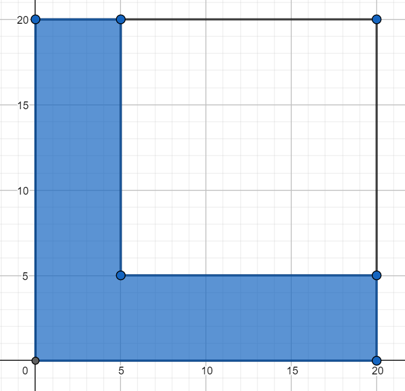
</p>

Sytuację, w której ten tramwaj, na który czas oczekiwania jest krótszy, przyjedzie w ciągu najbliższych 5 minut, ilustruje zaznaczony na niebiesko wielokąt. Jego pole wynosi 175. Wobec tego prawdopodobieństwo tego, że najwcześniejszy tramwaj nadjedzie w ciągu 5 minut, wynosi:

$P = \frac{175}{400} = \frac{7}{16} = 0.4375.$

### Zadanie 3

Dwóch kolegów z pracy mieszka w niewielkiej odległości od siebie i jeżdżą do pracy tramwajem, wsiadając doń na tym samym przystanku. W firmie, w której pracują, nie ma konieczności przychodzenia do pracy na określoną godzinę. Pracownik ma stawić się w pracy między godz. 8:30 a 9:30. Wobec tego każdy z dwóch kolegów jeździ do pracy tramwajem odjeżdżającym z ich przystanku między godz. 7:00 i 8:00, każdego dnia przybywając na przystanek w dowolnym momencie między tymi godzinami. Tramwaj, którym jeżdżą do pracy, odjeżdża z ich przystanku o godz. 7:00 i potem co 15 minut. Koledzy nigdy się nie umawiają, o której godzinie pojadą do pracy danego dnia, więc zdarza się, że jadą tym samym tramwajem, ale zdarza się też, że się rozmijają. Oblicz prawdopodobieństwo, że koledzy jadą do pracy tym samym tramwajem.

Rozwiązanie:

Tym razem ilustracją dla opisanej sytuacji będzie kwadrat o wierzchołkach w punktach $(0,0), (60,0), (60,60)$ i $(0,60)$. Współrzędne każdego punktu w tym kwadracie oznaczają liczbę minut po godzinie 7:00, gdy każdy z dwóch kolegów przybywa na przystanek (np. punkt $(32,48)$ oznacza sytuację, gdy jeden z kolegów przybywa na przystanek o godzinie 7:32 a drugi o godz. 7:48).

<p align="center">
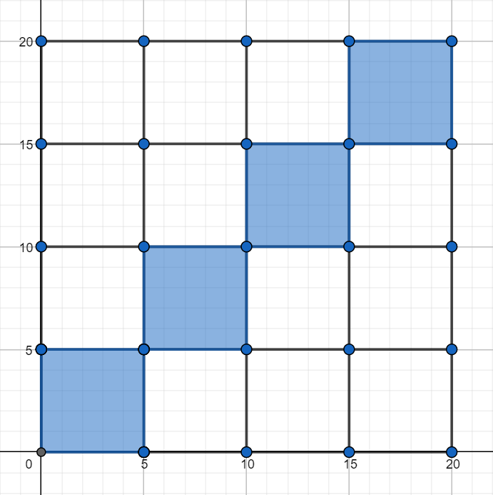
</p>

Pole tego kwadratu wynosi $60^2=3600$. Jeśli obaj koledzy przyjdą na przystanek w tym samym kwadransie, to pojadą do pracy tym samym tramwajem, w przeciwnym razie pojadą różnymi tramwajami. W takim razie sytuację, gdy obaj koledzy jadą jednym tramwajem, ilustrują cztery zaciemnione kwadraty. Suma pól tych kwadratów wynosi $4·15^2=900$. Wobec tego prawdopodobieństwo tego, że obaj koledzy jadą jednym tramwajem, wynosi:

$P = \frac{900}{3600}=0.25.$

### Zadanie 4
Monetę jednogroszową (średnica: 15,5 mm) rzucono losowo na szachownicę, której każde z pól jest kwadratem o boku 5,5 cm. Zakładamy, że moneta upadła na obszar wyznaczony przez pola. Jakie jest prawdopodobieństwo, że znajduje się ona w całości w jednym z pól?

Rozwiązanie:

Wystarczy rozważyć tylko jedno pole szachownicy.
Aby moneta znajdowała się całkowicie w polu szachownicy jej środek musi znajdować się w kwadracie mniejszym od pola szachownicy. Dowolny bok mniejszego kwadratu musi być oddalony od pola szachownicy o promień monety. Sytuację taką widać na poniższym rysunku.

<p align="center">
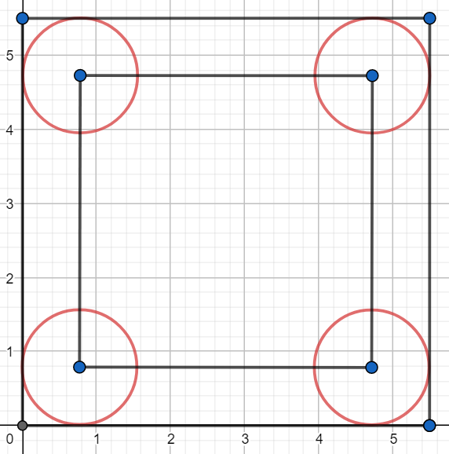
</p>

Szukane prawdopodobieństwo to pole pole mniejszego kwadratu podzielone przez pole kwadratu szachownicy:

$P = \frac{(5.5 - 1.55)^2}{5.5^2} = \frac{15.6025}{30.25} \approx 0.52$

### Zadanie 5
Kilka lat temu, gdy w użyciu były jeszcze kasety magnetofonowe, dziennikarz wybrał się na wywiad i zabrał ze sobą dyktafon i kasetę ze 120-minutową taśmą (tzn. jedna strona kasety mieściła nagranie 60 minut). Nagranie wywiadu na kasecie zajmowało na taśmie czas dokładnie od 21 do 34 minuty ustalonej strony kasety. Potem dziennikarz nagrywał na tej samej stronie kasety jeszcze inne materiały. Po powrocie do domu przesłuchiwał różne fragmenty nagrań z tej kasety, przewijając ją to w przód, to w tył. W końcu, nie zdając sobie sprawy, w którym momencie taśmy jest, postanowił przewinąć taśmę do początku, wcisnął więc przycisk i poszedł do kuchni. Wrócił po 15 minutach z przerażeniem odkrył, że zamiast przycisku przewijania wcisnął przycisk nagrywania. Natychmiast wyłączył nagrywanie. Niestety w ten sposób skasował 15 minut z materiału, jaki był zarejestrowany na jej samej stronie kasety co wywiad. Oblicz prawdopodobieństwo, że nie skasowało się nic z wywiadu, jaki tego dnia przeprowadzał dziennikarz.

Rozwiązanie:

Ponieważ nieuważne nagranie trwa dokładnie 15 minut to jego początek musi znajdować się gdzieś pomiędzy 0 a 45 minutą taśmy. Długość tego przedziału będzie mocą zbioru $\Omega$.

Aby określić moc zbioru zdarzeń sprzyjających $A$ należy ustalić w których minutach mogło zacząć się nagrywanie aby nie skasować wywiadu. Ponieważ wywiad znajduje się dokładnie od 21 do 34 minuty nagranie takie może zacząć się od 0 do 6 minuty, oraz od 34 do 45 minuty. Suma długości tych dwóch przedziałów to moc zbioru $A$. Szukane prawdopodobieństwo to:

$P = \frac{(6 - 0) + (45 - 34)}{45 - 0} = \frac{17}{45} \approx 0.38.$

### Zadanie 6
Z przedziału $(0,1)$ losujemy liczbę $a$ następnie niezależnie od niej z przedziału $(-1,1)$ losujemy liczbę $b$. Jakie jest prawdopodobieństwo, że miejsce zerowe funkcji $y = ax+b$ jest dodatnie?

Rozwiązanie:

Znajduję miejsce zerowe funkcji $y = ax+b$:

$ax+b = 0$

$ax = -b$

$x = -\frac{b}{a}$

Aby $x$ było dodatnie to liczba $a$ lub $b$ musi być ujemna, ponieważ $a \in (0, 1)$, $b \in (-1, 1)$ to wystarczy aby $b \in (-1, 0)$.

Przedstawię losowanie opisane w zadaniu na poniższym wykresie, gdzie zacieniowany obszar to zbiór punktów dla których $b \in (-1, 0)$.

<p align="center">
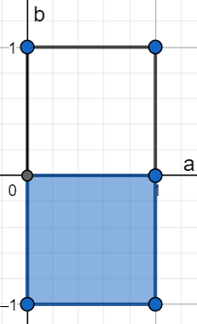
</p>

Pole zacieniowanej części przez pole całkowite to szukane prawdopodobieństwo:

$P = \frac{1}{2} = 0.5$

Druga metoda rozwiązania:

Ponieważ wystarczy rozpatrzeć tylko parametr $b$ można obliczyć szukane prawdopodobieństwo za pomocą długości odcinka $(-1, 0)$ podzielonego przez długość odcinka $(-1, 1)$.

### Zadanie 7
Ala i Jacek - matematycy - umówili się w kawiarni, ale nie umówili się co do konkretnej godziny. Ustalili tylko, że każde z nich przyjdzie do kawiarni w dowolnym momencie między godziną 12.00 a 13.00 i jeśli nie spotka wewnątrz drugiego, poczeka 20 minut (lub krócej, jeśli wybije już 13.00) i jeśli się nie doczeka na drugie, wyjdzie. Jakie jest prawdopodobieństwo, że Ala i Jacek nie rozminą się ale spotkają się w kawiarni?

Rozwiązanie:

Podobnie jak w poprzednich zadaniach rozwiązanie będzie sprowadzało się do narysowania odpowiedniego wykresu. Ponieważ Ala i Jacek mogą przyjść do kawiarni pomiędzy godziną 12:00 a 13:00 to wykresem będzie kwadrat o wymiarze 60x60. Każdy punkt $(x, y)$ wykresu przedstawia możliwe kombinacje godzin przyjścia pary matematyków do kawiarni. Na przykład punkt $A = (10, 40)$ oznacza, że Ala przyjdzie do kawiarni o godzinie 12:10 a Jacek o godzinie 12:40. Nas interesuje taka sytacja gdzie współrzędne punktu nie różnią się od siebie o więcej niż 20. Możemy zapisać taką sytuację w następujący sposób:

$|y - x| \le 20,$

$-20 \le y-x \le 20,$

$x - 20 \le y \le x + 20.$

Oznacza to, że punkt $(x, y)$ leży w kwadracie pomiędzy prostymi o równaniach:

$y = x - 20$ 

i

$y = x + 20.$

Sytuację taką ilustruje poniższy wykres:

<p align="center">
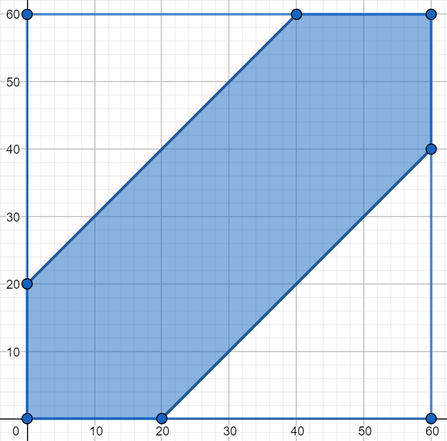
</p>

Pole zacieniowaniego obszaru to różnica pola kwadratu i dwóch białych trójkątów, stąd szukane prawdopodobieństwo to:

$P = \frac{(3600 - 2 * 800)}{3600} = \frac{2000}{3600} = \frac{5}{9} \approx 0.56$

### Zadanie 8

Monetę o średnicy $d$ upuszczono na posadzkę wyłożoną kafelkami o wzorze jak na zdjęciu, gdzie ramię każdego spośród białych i czarnych trójkątów prostokątnych równoramiennych ma długość $a$. Jakie jest prawdopodobieństwo, że moneta upadnie w taki sposób, że będzie się w całości znajdowała wewnątrz jednego białego lub czarnego trójkąta? Zakładamy, że posadzkę położono bez fug i że trójkąty są na tyle duże, że moneta zmieści się w całości w jednym z nich.

Rozwiązanie:

Rozumowanie jest analogiczne do zadania 4 jednak rozwiązanie jest trudniejsze. Sytuację z zadania prezentuje poniższy wykres:

<p align="center">
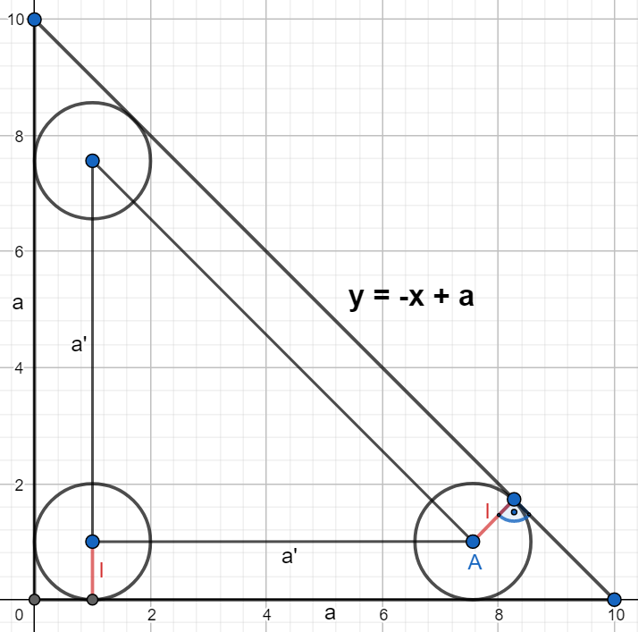
</p>

Aby obliczyć pole mniejszego trójkąta należy znaleźć $a'$ co jest długością podstawy trójkąta. Aby wyznaczyć $a'$ należy wyznaczyć współrzędną $x$ punktu $A$. W tym celu wyznaczę równanie prostej równoległej do prostej o równaniu $y = -x + a$ i przechodzącej przez punkt $A$:

Równanie ogólne prostej to:

$y = z_1x + z_2.$

Ponieważ punkt $A$ jest oddalony od danej prostej o odległość $l$ to równanie prostej równoległej przechodzącej przez punkt $A$ w naszym przypadku (chodzi o ujemny znak przed członem z $l$) ma równanie:

$y = z_1x + z_2 -l \sqrt{1 + z_1^2}$,

ponieważ:

$z_1 = -1,$

$z_2 = a,$

$l = \frac{d}{2},$

to:

$y = -x + a - \frac{d}{2} \sqrt{1 + (-1)^2}$,

$y = -x + a - \frac{d \sqrt{2}}{2}$,

$x = a - \frac{d \sqrt{2}}{2} - y.$

Współrzędna $x$ dla $y = \frac{d}{2}$ ma wartość:

$x = a - \frac{d \sqrt{2}}{2} - \frac{d}{2}.$

Długość $a'$ wynosi:

$a' = a - \frac{d \sqrt{2}}{2} - \frac{d}{2} - \frac{d}{2},$

$a' = a - \frac{d \sqrt{2}}{2} - d.$


Szukane prawdopodobieństwo to pole mniejszego trójkąta przez pole większego trójkąta, stąd:

$P = \frac{\frac{1}{2} \left(a - \frac{d \sqrt{2}}{2} - d\right)^2}{\frac{1}{2} a^2} = \frac{\left(a - \frac{d \sqrt{2}}{2} - d\right)^2}{a^2} = 
\frac{\frac{1}{2} \left(a\sqrt{2} - d - d \sqrt{2} \right)^2}{a^2} = 
\frac{\left(a\sqrt{2} - d - d \sqrt{2} \right)^2}{2a^2}$

### Zadanie 9
Z przedziału $(-3,3)$ losujemy liczbę $m$. Oblicz prawdopodobieństwo, że trójmian kwadratowy $x^2+2mx+m+2$ ma dwa pierwiastki.

Rozwiązanie:

Aby trójmian kwadratowy miał dwa pierwiastki to wyróżnik trójmianu kwadratowego musi być dodatni. Obliczam wyróżnik:

$\Delta = 4m^2 - 4(m+2) = 4m^2 -4m - 8.$

Sprawdzam kiedy wyróżnik jest większy od zera:

$4m^2 -4m - 8 > 0,$

$m^2 - m - 2 > 0,$

$\Delta_m = 1 - (-8) = 9,$

$m_1 = \frac{1 - 3}{2} = -1,$

$m_2 = \frac{1 + 3}{2} = 2.$

Rysuję stosowny wykres:

import pylab as plt
import numpy as np

```python
import numpy as np
import matplotlib.pylab as plt

def y(x):
  return x**2 - x - 2

x = np.linspace(-3, 3)
x_1 = np.linspace(-3, -1)
x_2 = np.linspace(2, 3)
plt.fill_between(x_1, y(x_1), color="steelblue", alpha=0.3)
plt.fill_between(x_2, y(x_2), color="steelblue", alpha=0.3)
plt.plot(x, y(x))
plt.axhline(y=0, color="black")
plt.show()
```

<p align="center">
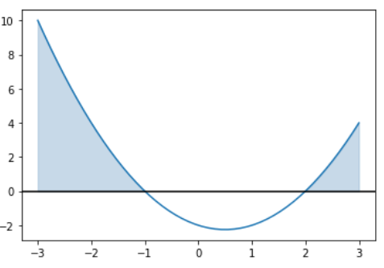
</p>

Jak można odczytać z zacieniowanego wykresu wyróżnik jest większy od zera gdy $m \in (-3, -1) \cup (2, 3)$. Szukane prawdopodobieństwo to:

$P = \frac{(-1 - (-3)) + (3 - 2)}{3 - (-3)} = \frac{3}{6} = 0.5.$

### Zadanie 10
Na koło o promieniu $R$ losowo ”rzucono” punkt. Znaleźć prawdopodobieństwo tego, że punkt trafi do wnętrza:\
a) kwadratu wpisanego w koło,\
b) trójkąta równobocznego wpisanego w koło.\
Zakładamy, ze prawdopodobieństwo trafienia punktu w daną część koła jest proporcjonalne do pola tej części i nie zależy od jej położenia w kole.

Rozwiązanie:

a)\
Przekątna kwadratu wpisanego w koło ma długość równą średnicy koła jest to $2R$. Długość $a$ boku kwadratu można obliczyć z prostej zależności:

$2R = a\sqrt{2},$

$a = \frac{2R}{\sqrt{2}} = \sqrt{2}R.$

Szukane prawdopodobieństwo to pole kwadratu podzielone przez pole koła:

$P = \frac{(\sqrt{2}R)^2}{\pi R^2} = \frac{2R^2}{\pi R^2} = \frac{2}{\pi} \approx 0.64$

b)
Aby obliczyć długość boku trójkąta równobocznego wpisanego w koło można skorzystać z poniższego wzoru:

$R=\frac{\sqrt{3}a}{3},$

$a=\frac{3R}{\sqrt{3}} = \sqrt{3}R.$

Pole trójkąta równobocznego to:

$p_t = \frac{a^2 \sqrt{3}}{4},$

$p_t = \frac{(\sqrt{3}R)^2\sqrt{3}}{4} = \frac{3\sqrt{3}R^2}{4}.$

Szukane prawdopodobieństwo to:

$P = \frac{\frac{3\sqrt{3}R^2}{4}}{\pi R^2} = \frac{3\sqrt{3}}{4\pi} \approx 0.41$

### Zadanie 11
Wybieramy losowo punkt $(x, y)$ z kwadratu $[0, 1] × [0, 1]$. Jakie jest prawdopodobieństwo, że jego współrzędne będą spełniały nierówność $y < x^2$?

Rozwiązanie:

Należy znaleźć pole pod wykresem danej funkcji i części wspólnej z danym kwadratem. Sytuację przedstawia niższy rysunek.

<p align="center">
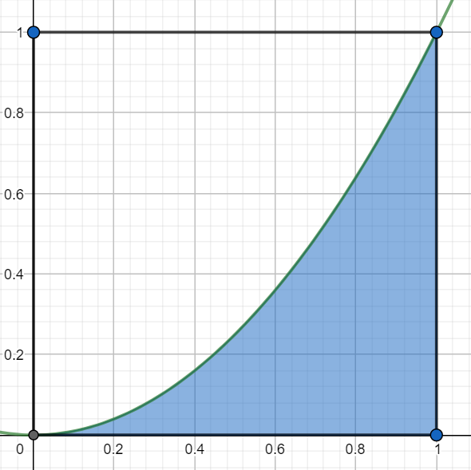
</p>

Jak widać na rysunku należy obliczyć pole pod wykresem funkcji w przedziale $[0, 1]$. Funkcja jest parabolą więc aby dokładnie obliczyć pole pod jej wykresem należy użyć całki:

$p_p = \int_0^1 x^2 dx = \frac{x^3}{3} \biggr|_{0}^{1} = \frac{1}{3}.$

Szukane prawdopodobieństwo to iloraz pola pod wykresem i pola kwadratu:

$P = \frac{\frac{1}{3}}{1} = \frac{1}{3} \approx 0.33.$

Poniżej całka z zadania obliczona numerycznie w pythonie za pomocą funkcji <b>quad</b>:

```python
from scipy.integrate import quad

def f(x):
  return x**2

i, err = quad(f, 0, 1)
print(i)
```

### Zadanie 12
Na odcinku $OA$ o długości $L$ na osi liczbowej $OX$, losowo wybrano punkt $B$. Znaleźć prawdopodobieństwo tego, że mniejszy z odcinków $OB$ i $BA$ będzie miał długość większa niż $\frac{1}{3}L$. Zakładamy, że prawdopodobieństwo trafienia punktu na odcinek jest proporcjonalne
do długości odcinka i nie zależy od jego położenia na osi liczbowej $OX$.

Rozwiązanie:

Należy zastanowić się gdzie w którym miejscu można wybrać punkt $B$ aby spełnione zostały warunki zadania. Zobaczmy rysunek:

<p align="center">
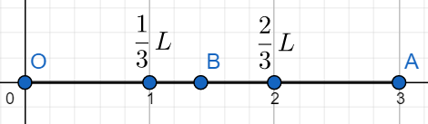
</p>

Jeżeli punkt $B$ będzie leżał pomiędzy $0$ a $\frac{1}{3}L$ to mniejszy z odcinków $OB$, $BA$ nie będzie miał długości większej niż $\frac{1}{3}L$. Jeżeli punkt $B$ będzie leżał pomiędzy $\frac{1}{3}L$ a $\frac{2}{3}L$ to mniejszy z odcinków $OB$, $BA$ zawsze będzie miał długości większą niż $\frac{1}{3}L$ co spełnia założenia w zadaniu. Ostatni przedział jest analogiczny do pierwszego i nie spełnia wymagań zadania.

Szukane prawdopodobieństwo to iloraz długości odcinka $OA$ i odcinka pomiędzy $\frac{1}{3}L$ a $\frac{2}{3}L$:

$P = \frac{\frac{2}{3}L - \frac{1}{3}L}{L} = \frac{1}{3} \approx 0.33.$

### Zadanie 13
Wewnątrz danego odcinka o długości $a$ obieramy losowo 2 punkty: jeden na lewo, a drugi na prawo od środka odcinka. Jakie jest prawdopodobieństwo, że odległość między wybranymi punktami jest mniejsza niż $\frac{1}{3}a$?

Rozwiązanie:

Oznaczmy punkty jako $x$ i $y$. Punkty te muszą spełniać następującą nierówność:

$|y - x| < \frac{1}{3}a,$

$-\frac{1}{3}a < y-x < \frac{1}{3}a,$

$x - \frac{1}{3}a < y < x + \frac{1}{3}a.$

Niech $x$ oraz $y$ będą współrzędnymi punktu w przestrzeni dwuwymiarowej wtedy punkt $A = (x, y)$ leży pomiędzy prostymi o równaniach:

$y = x - \frac{1}{3}a$ 

i

$y = x + \frac{1}{3}a.$

Ponieważ punkt $x$ wybieramy na lewo od połowy odcinka a punkt $y$ na prawo to punktu $A$ musi znajdować się dodatkowo w odpowiednim kwadracie co przedstawione zostało na poniższym rysunku.

<p align="center">
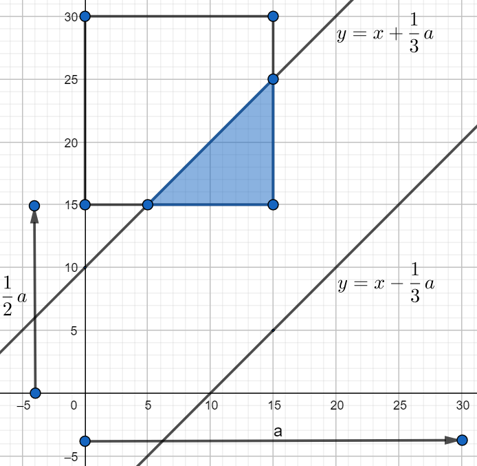
</p>

Wszystkie możliwości wyboru punktu $A$ przedstawia zaznaczony kwadrat, nas interesują jednak punkty z zacieniowanej części gdyż należą do kwadratu a dodatkowo leżą pomiędzy wyznaczonymi prostymi. Pole zacieniowanego trójkąta to:

$p_t = \frac{1}{2}\left(\frac{1}{3}a\right)^2 = \frac{1}{18}a^2$

Pole zaznaczonego kwadratu to:

$p_k = \left(\frac{1}{2}a\right)^2 = \frac{1}{4}a^2$

Szukane prawdopodobieństwo to iloraz pola trójkąta i pola kwadratu:

$P = \frac{p_t}{p_k} = \frac{\frac{1}{18}a^2}{\frac{1}{4}a^2} = \frac{2}{9}\approx 0.22.$

### Zadanie 14
Wewnątrz danego odcinka o długości $a$ obieramy na "chybił trafił" dwa punkty. Jakie jest prawdopodobieństwo, że odległość między punktami jest mniejsza niż $\frac{1}{3}a$?

Rozwiązanie:

Zadanie jest prawie takie samo jak zadanie poprzednie, inna jest tylko możliwość wyboru dwóch punktów bo możemy to zrobić na całej długości odcinka więc kwadrat na rysunku będzie 4 razy większy, proste pomiędzy którymi może znajdować się punkt $A$ mają takie same równania jak w poprzednim zadaniu.

<p align="center">
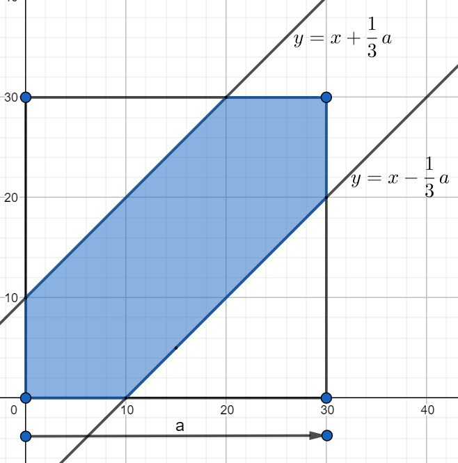
</p>

Pole zacieniowanej części to:

$p_z = a^2 - 2 \cdot \frac{1}{2} \left(\frac{2}{3}a^2\right) = \frac{5}{9}a^2.$

Szukane prawdopodobieństwo to:

$P = \frac{\frac{5}{9}a^2}{a^2} = \frac{5}{9} \approx 0.56.$

### Zadanie 15
Na płaszczyźnie poprowadzono proste równoległe. Odległość między nimi jest stała i równa $d$. Na płaszczyznę rzucamy igłę (tak cienką, że może być interpretowana jako odcinek) o długości $l$, przy czym $l < d$. Jakie jest prawdopodobieństwo, że igła przetnie jedną z wykreślonych prostych? (Jest to tzw. zadanie Buffona).

Rozwiązanie:

Zacznę od narysowania rysunku.

<p align="center">
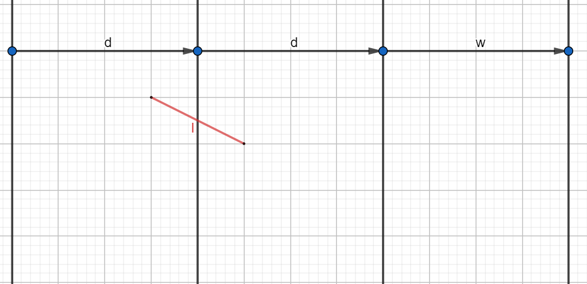
</p>

W tym zadaniu wystarczy rozpatrzeć odpowiedni obszar z jednej strony wybranej prostej (oczywiście jest ich na płaszczyźnie nieskończenie wiele. W tego typu zadaniach zawsze dobrze oznaczyć środek rzucanego przedmiotu (w poprzednich zadaniach był to środek monety). Oznaczmy odległość środka igły od wybranej prostej jako $x$, ponieważ rozpatrujemy obszar z jednej strony prostej to środek igły może upaść od prostej do maksymalnej odległości $\frac{d}{2}$, daje to warunek dla $x$:

$0 \le x \le \frac{d}{2}.$

Igła może upaść pod dowolnym kątem, oznaczam więc kąt między prostą a igłą jako $\alpha$, jak łatwo zauważyć kąt ten spełnia warunek:

$0 \le \alpha \le \pi.$

Położenie igły opisują dwa parametry więc ich wszystkie kombinacje jak w tego typu zadaniach można przedstawić jako odpowiedni prostokąt. Moc zbioru zdarzeń elementarnych to pole tego prostokąta, które wynosi:

$|\Omega| = \frac{d}{2} \pi.$

Zastanówmy się kiedy igła upadnie tak aby przeciąć prostą. Korzystając z funkcji sinus od razu możemy stwierdzić, że kiedy $x$ spełnia następujący warunek:

$0 \le x \le \frac{l}{2}sin(\alpha)$.

Narysuję teraz odpowiedni wykres korzystając z wszystkich 3 warunków:

<p align="center">
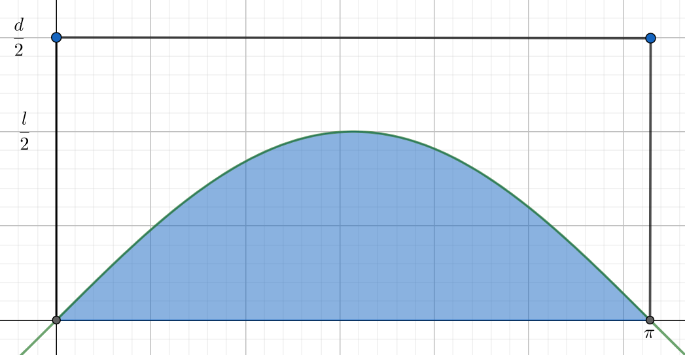
</p>

Moc zbioru zdarzeń sprzyjających to zacienione pole:

$|A| = \int_0^{\pi} \frac{l}{2} sin(\alpha)d\alpha = -\frac{l}{2}cos(\alpha)\biggr|_{0}^{\pi} = -\frac{l}{2}(-1-1) = l.$

Szukane prawdopodobieństwo to:

$P = \frac{|A|}{|\Omega|}\frac{l}{\frac{d}{2} \pi} = \frac{2l}{d\pi}$

Dodatek:

Jeżeli przyjmiemy, że $l = \frac{d}{2}$ to szukane prawdopodobieństwo wyniesie:

$P = \frac{1}{\pi}.$

Mając powyższą wiedzę można wykonać symulację w której oszacujemy wartość $\pi$:

```python
import scipy.stats as st
import numpy as np

d = 10
l = d / 2
N_boot = 100000

A = []
for i in range(N_boot):
  x = st.uniform.rvs(0, d/2)
  alpha = st.uniform.rvs(0, np.pi)
  A.append((x, alpha))

res = [1 for x, alpha in A if x <= (l / 2) * np.sin(alpha)]

print(N_boot / sum(res))
```

### Zadanie 16
Parę liczb $(b, c)$ wybrano losowo z prostokąta $[0, 2]×[0, 4]$. Jakie jest prawdopodobieństwo, że pierwiastki równania $x^2 + 2bx + c = 0$ są rzeczywiste?

Rozwiązanie:

Pierwiastki trójmianu kwadratowego są rzeczywiste gdy jego wyróżnik jest większy bądź równy 0:

$\Delta = (2b)^2 - 4c = 4b^2 - 4c \ge 0,$

$b^2 - c \ge 0,$

$c \le b^2$

Rysuję stosowny rysunek:

<p align="center">
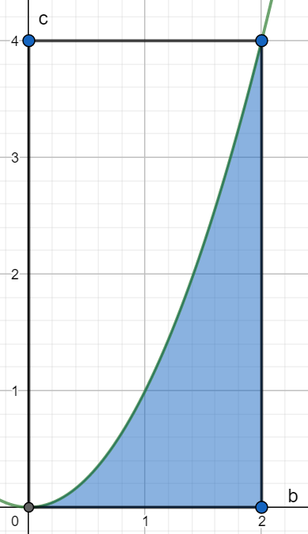
</p>

Zacienionie pole to moc zbioru zdarzeń sprzyjających, obliczam stosowną całkę i prawdopodobieństwo:

```python
from scipy.integrate import quad

def f(x):
  return x**2

i, err = quad(f, 0, 2)
print("Prawdopodobienstwo wynosi:", i/8)
```

### Zadanie 17
Jakie jest prawdopodobieństwo, ze pierwiastki równania $x^2 + 2bx + c = 0$sa rzeczywiste, jeśli liczby $b$ i $c$ zostały wybrane losowo z przedziału $[0, 1]$?

Rozwiązanie:

Zadanie jest analogiczne do poprzedniego a szukane prawdopodobieństwo to:

$P = \frac{1}{3}$

### Zadanie 18
Parę liczb $(a, b)$ wybrano losowo z prostokąta $[−1, 1]^2$. Oblicz prawdopodobieństwo, że równanie $ax^2 + bx + 1 = 0$ ma:\
a) pierwiastki rzeczywiste,\
b) pierwiastki równe,\
c) pierwiastki rzeczywiste dodatnie.

Rozwiązanie:

Standardowo należy zacząć od wyznaczenia wyróżnika trójmianu kwadratowego:

$\Delta = b^2 - 4a.$

a)\
Pierwiastki są rzeczywiste gdy:

$b^2 - 4a \ge 0,$

$a \le \frac{1}{4}b^2$

<p align="center">
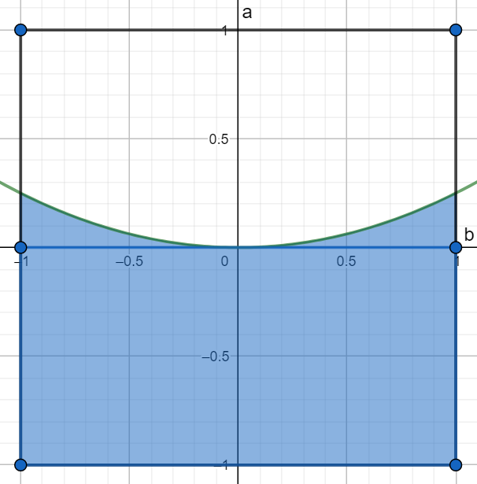
</p>

Należy znaleźć zacienione pole:

$p_z = 2 + \int_{-1}^1 \frac{1}{4}b^2 db = \frac{13}{6}$

Szukane prawdopodobieństwo to:

$P = \frac{\frac{13}{6}}{4} = \frac{13}{24} \approx 0.54.$

b)\
Pierwiastki są równe gdy:

$b^2 - 4a = 0,$

Ponieważ w takiej sytuacji nie można mówić o polu pod wykresem (rozwiązaniem jest jeden punkt a punkt nie ma pola) to szukane prawdopodobieństwo wynosi:

$P = 0.$

c)\
W tym podpunkcie skorzystam z wzorów Viete'a. Postać ogólna trójmianu kwadratowego:

$y = z_1x^2 + z_2x + z_3,$

wzory:

$x_1 x_2 = \frac{z_3}{z_1},$

$x_1 + x_2 = -\frac{z_2}{z_1}.$

Aby obydwa pierwiastki były tego samego znaku to:

$x_1x_2 = \frac{z_3}{z_1} = \frac{1}{a} > 0,$

$a > 0.$

Mamy warunek na to aby pierwiastki były tego samego znaku ale nie wiadomo czy są dodatnie czy ujemne. Jeżeli pierwiastki mają być dodatnie to:

$x_1 + x_2 = -\frac{z_2}{z_1} = -\frac{b}{a} > 0,$

wiemy że $a > 0$ więc z powyższego równania wynika, że $b < 0$.

Uwzględniając wszystkie warunki można narysować rysunek:

<p align="center">
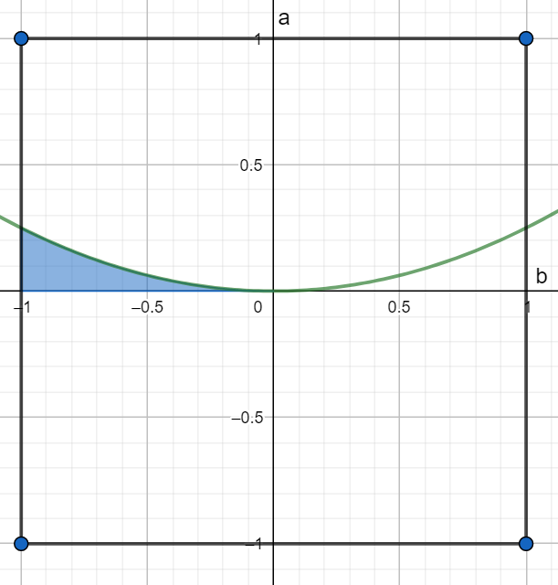
</p>

Szukane pole to:

$p_z = \int_{-1}^0 \frac{1}{4}b^2db = \frac{1}{12}.$

Ostatecznie prawdopodobieństwo to:

$P = \frac{\frac{1}{12}}{4} = \frac{1}{48} \approx 0.02$

### Zadanie 19
Jakie jest prawdopodobieństwo, ze losowo wybrany punkt kwadratu ${|x| < 1, |y| < 1}$ jest punktem leżącym wewnątrz okręgu $x^2 + y^2 = 1$?

Rozwiązanie:

Szukane prawdopodobieństwo to iloraz pola koła ograniczonego przez okrąg i pola kwadratu:

$P = \frac{\pi}{4} \approx 0.79.$

### Zadanie 20
Drewniane pale maja losowa długość $L$, przy czym największa długość wynosi 12 m. Pale są przeznaczone do wbijania w ziemie, której skalna warstwa stanowiąca opór znajduje się na losowej głębokości $H$, której maksimum wynosi 10 m. Zaproponować przestrzeń zdarzeń elementarnych i podać jej interpretację geometryczną. Zilustrować następujące zdarzenia i obliczyć ich prawdopodobieństwa:\
a) długość losowo wziętego pala jest większa od głębokości, na której znajduje się skalna warstwa,\
b) głębokość skalnej warstwy przekroczy 8 m,\
c) długość losowo wziętego pala przekroczy 8 m.

Rozwiązanie

Przestrzenią zdarzeń elementarnych będzie zbiór punktów $(L, H)$. Zbiór taki to prostokąt o bokach długości 12 i 10.

a)\
$H < L$

<p align="center">
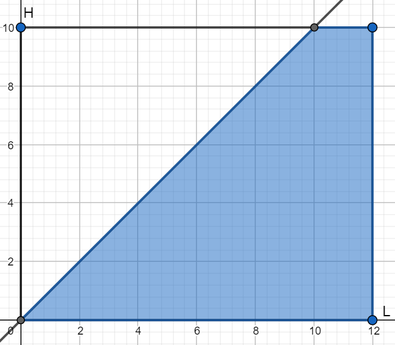
</p>

Szukane prawdopodobieństwo to:

$P = \frac{\frac{1}{2} \cdot 10^2 + 2 \cdot 10}{10 \cdot 12} = \frac{7}{12} \approx 0.58$

b)\
$P = \frac{2}{10} = 0.2,$

ponieważ głębokość większa niż 8 znajduje się w przedziale $(8, 10)$ a jego długość wyosi 2.

c)\
$P = \frac{4}{12} \approx 0.33,$

analogicznie jak w podpunkcie wyżej.

### Zadanie 21
Przy projektowaniu przepustu odprowadzającego wodę z 2 oddzielnych obszarów $A$ i $B$ założono, ze ilość wody pochodząca z $A$ może wahać się w granicach $0−900$ $dm^3/s$, natomiast z $B$: $0−1500$ $dm^33/s$. Obliczyć prawdopodobieństwo, ze ilość wody łącznie z obu
obszarów przekroczy $2000$ $dm^3/s$.

Rozwiązanie:

Niech $A$ i $B$ oznacza ilość wody z każdego przepustu wtedy musimy znaleźć:

$A + B > 2000,$

$B > 2000 - A.$

<p align="center">
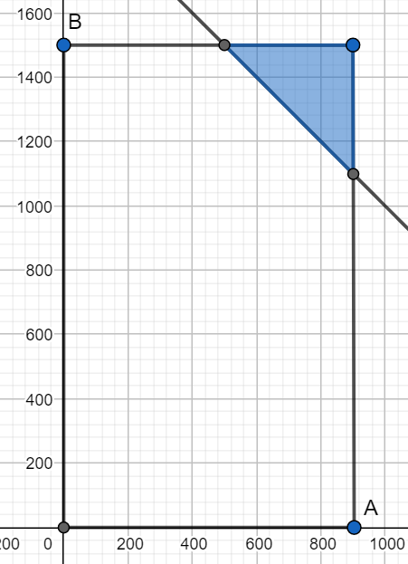
</p>

Szukane prawdopodobieństwo to:

$P = \frac{\frac{1}{2} \cdot 400^2}{900 \cdot 1500} = \frac{8}{135} \approx 0.06.$

### Zadanie 22
Z przedziału $(0, \pi)$ wybrano losowo punkty $x$ i $y$. Obliczyć prawdopodobieństwo tego, że $sin(x) ­ \ge 2y$.

Rozwiązanie:

$sin(x) ­ \ge 2y,$

$y \le \frac{1}{2}sin(x)$

<p align="center">
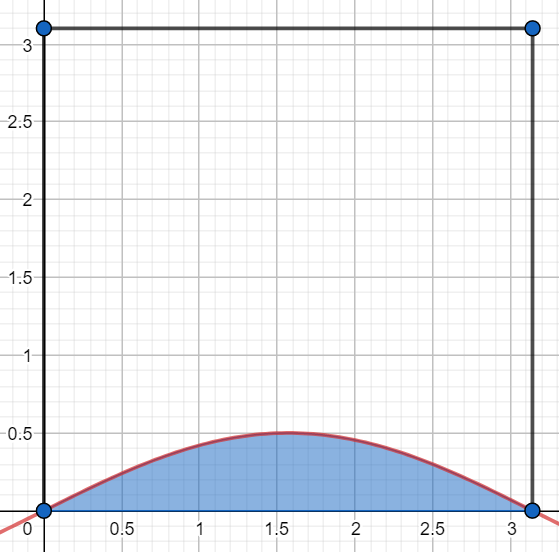
</p>

Rozwiązanie w pythonie:

```python
from scipy.integrate import quad
import numpy as np

def f(x):
  return 0.5 * np.sin(x)

i, err = quad(f, 0, np.pi)
print("Prawdopodobienstwo wynosi:", i/(np.pi**2))
```

### Zadanie 22
Dwa punkty $A$ i $B$ zostały wybrane losowo z I ćwiartki układu współrzędnych, a następnie każdy z nich połączono z początkiem $O$ układu współrzędnych. Obliczyć prawdopodobieństwo, że obie proste będą nachylone do siebie pod katem mniejszym niż $\frac{\pi}{4}$.

Rozwiązanie:

Oznaczam nachylenie odcinka $OA$ do osi $OX$ jako $\alpha$, analogicznie robię z nachyleniem odcinka $OB$ i oznaczam go jako $\beta$. Warunki zadania są spełnione gdy:

$|\beta - \alpha| < \frac{\pi}{4},$

$\alpha - \frac{\pi}{4} < \beta < \alpha + \frac{\pi}{4}$

Ponieważ punkty wybrane są z I ćwiartki układu to kąty mieszczą się w przedziale $(0, \frac{\pi}{2})$, kąt $\beta$ leży natomiast pomiędzy prostymi wyznaczonymi powyżej.

<p align="center">
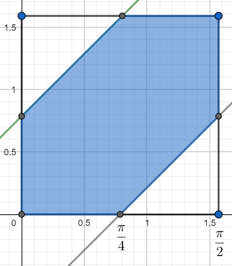
</p>

Szukane prawdopodobieństwo to:

$P = \frac{\left(\frac{\pi}{2}\right)^2 - 2 \cdot \frac{1}{2}\cdot \left(\frac{\pi}{4}\right)^2}{\left(\frac{\pi}{2}\right)^2} = \frac{\frac{\pi^2}{4} - \frac{\pi^2}{16}}{\frac{\pi^2}{4}} = \frac{3}{4} = 0.75.$