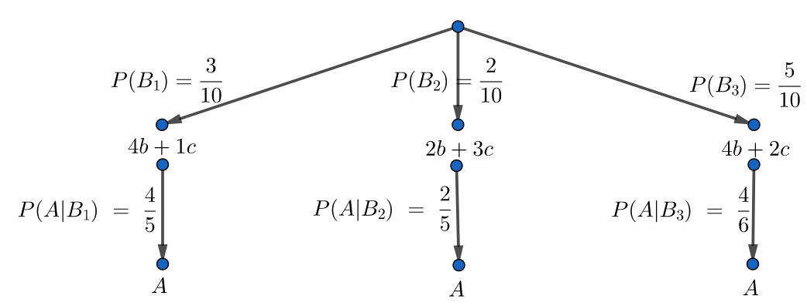

# Prawdopodobieństwo całkowite
Jeżeli zdarzenia $B_1, B_2, ... ,B_n$ są parami rozłączne oraz mają prawdopodobieństwa dodatnie, które sumują się do jedynki, to dla dowolnego zdarzenia $A$ zachodzi wzór:
$$P(A)=P(A|B_1)⋅P(B_1)+P(A|B_2)⋅P(B_2)+...+P(A|B_n)⋅P(B_n)$$

###Wzór Bayesa
Jeżeli zdarzenia $B_1, B_2,...,B_n$ są parami rozłączne oraz mają prawdopodobieństwa dodatnie, które sumują się do jedynki, to dla dowolnego zdarzenia $A$ zachodzi wzór:
$$P(B_k|A) = \frac{P(A|B_k)⋅P(B_k)}{P(A)}$$

# Zadania

### Zadanie 1
Z jednej z trzech urn wylosowano jedną kulę. W urnie I są 4 kule białe i 1 kula czarna, w urnie II są 2 kule białe i 3 kule czarne, a w urnie III są 4 kule białe i 2 kule czarne. Prawdopodobieństwo wybrania do losowania urny I wyosi 3/10, urny II 2/10, a urny III 5/10. Oblicz prawdopodoieństwo, że wylosowana kula jest biała.

Rozwiązanie:

$B_i$ - zdarzenie polegające na wylosowaniu $i$-tej urny, gdzie $i \in \{1, 2, 3\}.$

$A$ - zdarzenie polegające na wylosowaniu kuli białej.

Należy skorzystać ze wzoru na prawdopodobieństwo całkowite. Dobrze też narysować diagram jak poniżej.

Korzystając z diagramu mamy:

$P(B_1) = \frac{3}{10}$\
$P(B_2) = \frac{2}{10}$\
$P(B_3) = \frac{5}{10}$\
$P(A|B_1) = \frac{4}{5}$\
$P(A|B_2) = \frac{2}{5}$\
$P(A|B_3) = \frac{4}{6}$

$P(A)=P(A|B_1)⋅P(B_1) + P(A|B_2)⋅P(B_2)+ P(A|B_3)⋅P(B_3) = \frac{4}{5} \cdot \frac{3}{10}  +  \frac{2}{5} \cdot \frac{2}{10} + \frac{4}{6} \cdot \frac{5}{10} = \frac{49}{75} \approx 0.65$

### Zadanie 2

Z jednej z dwóch urn wylosowano bez zwracania 2 kule. W urnie I są 4 kule białe i 3 kule czarne, a w urnie II jest 5 kul białych i 4 kule czarne. Prawdopodobieństwo wybrania do losowania urny I wynosi 1/3. Oblicz prawdopodobieństwo, że:\
a) wylosowano 2 kule czarne,\
b) kule są różnych kolorów,\
c) wśród kul jest kula biała.

Rozwiązanie:

Najlepiej narysować sobie diagram z wszystkimi możliwościami z danego podpunktu. Trzeba zwrócić uwagę, że najpierw wylosowano urnę a później dwie kule z tej urny.

a) $P(A) = \frac{1}{3} \cdot \frac{3}{7} \cdot \frac{2}{6} +
\frac{2}{3} \cdot \frac{4}{9} \cdot \frac{3}{8} \approx 0.16$

b)$P(A) = \frac{1}{3} \cdot \frac{4}{7} \cdot \frac{3}{6} +
\frac{1}{3} \cdot \frac{3}{7} \cdot \frac{4}{6} +
\frac{2}{3} \cdot \frac{5}{9} \cdot \frac{4}{8} +
\frac{2}{3} \cdot \frac{4}{9} \cdot \frac{5}{8} \approx 0.56$

c)$P(A) = \frac{1}{3} \cdot \frac{4}{7} \cdot \frac{3}{6} +
\frac{1}{3} \cdot \frac{4}{7} \cdot \frac{3}{6} +
\frac{1}{3} \cdot \frac{3}{7} \cdot \frac{4}{6} +
\frac{2}{3} \cdot \frac{5}{9} \cdot \frac{4}{8} +
\frac{2}{3} \cdot \frac{5}{9} \cdot \frac{4}{8} +
\frac{2}{3} \cdot \frac{4}{9} \cdot \frac{5}{8} \approx 0.84$

### Zadanie 3

W konferencji naukowej bierze udział 80% mężczyzn i 20% kobiet. Wsród kobiet jest 60% matematyczek i 40% informatyczek, a wśród mężczyzn jest 30% matematyków i 70% infornatyków. Oblicz prawdopodobieństwo, że losowo wybrana osoba jest matematykiem.

Rozwiązanie:

$B_1$ - zdarzenie polegające na tym, że wylosowa osoba będzie mężczyzną.

$B_2$ - zdarzenie polegające na tym, że wylosowa osoba będzie kobietą.

$A$ - zdarzenie polegające na wylosowaniu matematyka.

Należy skorzystać ze wzoru na prawdopodobieństwo całkowite. Mamy:

$P(B_1) = 0.8$\
$P(B_2) = 0.2$\
$P(A|B_1) = 0.3$\
$P(A|B_2) = 0.6$

$P(A)=P(A|B_1)⋅P(B_1) + P(A|B_2)⋅P(B_2) = 0.3 \cdot 0.8 + 0.6 \cdot 0.2 = 0.36$

### Zadanie 4

Towarzystwo ubezpieczeniowe sprzedaje 3 rodzaje pilis: typu A, B, C. Za określony okres ubezpieczenia towarzystwo wystawiło 30% polis typu A, 40% polis typu B, 30% polis typu C. Prawdopodobieństwo wygenerowania szkody przez losowo wybraną polisę określonego typu wynoszą: $p_A = 0.1$, $p_B = 0.05$, $p_C = 0.1$.\
a) Oblicz prawdopodobieństwo roszczenia z losowo wybranej polisy.\
b) Wybrany losowo właściciel polisy miał szkodę. Oblicz prawdopodobieństwo warunkowe, że posiadał on polisę typu A.

Rozwiązanie:

$B_1$ - zdarzenie polegające na wylosowaniu polisu typu A.

$B_2$ - zdarzenie polegające na wylosowaniu polisu typu B.

$B_3$ - zdarzenie polegające na wylosowaniu polisu typu C.

$A$ - zdarzenie polegające na wygenerowaniu szkody.

a) Należy skorzystać ze wzoru na prawdopodobieństwo całkowite. Mamy:

$P(B_1) = 0.3$\
$P(B_2) = 0.4$\
$P(B_3) = 0.3$\
$P(A|B_1) = 0.1$\
$P(A|B_2) = 0.05$\
$P(A|B_3) = 0.1$

$P(A)=P(A|B_1)⋅P(B_1) + P(A|B_2)⋅P(B_2)+ P(A|B_3)⋅P(B_3) = 0.1 \cdot 0.3 + 0.05 \cdot 0.4 + 0.1 \cdot 0.3 = 0.08$

b) Należy skorzystać z wzoru Bayesa i obliczyć $P(B_1 | A)$:

$P(B_1|A) = \frac{P(A|B_1)⋅P(B_1)}{P(A)}$

$P(B_1|A) = \frac{0.1⋅0.3}{0.08} = 0.375$

### Zadanie 5
Przed konkursem ogłoszono listę 200 pytań z dziedziny $D_1$, 100 pytań z dziedziny $D_2$ oraz 100 pytań z dziedziny $D_3$. Umiemy odpowiedzieć na 150 pytań z dziedziny $D_1$, na wszystkie pytania z dziedziny $D_2$ oraz na 80 pytań z dziedziny $D_3$. Jakie jest prawdopodobieństwo,
ze podczas konkursu odpowiemy na losowo zadane pytanie?

Rozwiązanie:

$D_1$ - zdarzenie polegające na wylosowaniu pytania z dziedziny $D_1$.

$D_2$ - zdarzenie polegające na wylosowaniu pytania z dziedziny $D_2$.

$D_3$ - zdarzenie polegające na wylosowaniu pytania z dziedziny $D_2$.

$A$ - zdarzenie polegające na wylosowaniu pytania na które odpowiemy.

$P(D_1) = \frac{200}{400} = \frac{1}{2},$

$P(D_2) = \frac{100}{400} = \frac{1}{4},$

$P(D_3) = \frac{100}{400} = \frac{1}{4},$

$P(A|D_1) = \frac{150}{200} = \frac{3}{4},$

$P(A|D_2) = \frac{100}{100} = 1,$

$P(A|D_3) = \frac{80}{100} = \frac{4}{5},$

$P(A)=\frac{1}{2} \cdot \frac{3}{4} + \frac{1}{4} \cdot 1 + \frac{1}{4} \cdot \frac{4}{5} = \frac{33}{40} = 0.825.$

### Zadanie 6
W magazynie znajdują się żarówki pochodzące z dwóch fabryk. 6% pochodzi z fabryki I. Wśród żarówek z fabryki I jest 1% wadliwych, a spośród żarówek z fabryki II 2% wadliwych. Z magazynu pobrano losowo jedna żarówkę, która okazała się wadliwa. Jakie jest prawdopodobieństwo tego, że ta żarówka została wyprodukowana przez fabrykę II?

Rozwiązanie:

$B_1$ - żarówka z fabryki I.

$B_2$ - żarówka z fabryki II.

$A$ - żarówka wadliwa.

$P(B_1) = 0.06,$

$P(B_2) = 0.94,$

$P(A|B_1) = 0.01,$

$P(A|B_2) = 0.02,$

Należy skorzystać z wzoru Bayesa i obliczyć $P(B_2 | A)$:

$P(B_2|A) = \frac{P(A|B_2) \cdot P(B_2)}{P(A)}$

$P(B_2|A) = \frac{0.02 \cdot 0.94}{0.06 \cdot 0.01 + 0.94 \cdot 0.02} \approx 0.969$

### Zadanie 7
Fabryka chemiczna jest wyposażona w system alarmowy. W razie zagrożenia system alarmowy działa w 95% przypadków. Prawdopodobieństwo, że system włączy się, gdy nie ma żadnego zagrożenia jest równe 0.02. Rzeczywiste zagrożenie zdarza się rzadko − jego prawdopodobieństwo wynosi 0.004. Gdy odzywa się system alarmowy, jakie jest prawdopodobieństwo, że naprawdę istnieje zagrożenie?

Rozwiązanie:

$B_1$ - zagrożenie.

$B_2$ - brak zagrożenia.

$A$ - system zadziałał.

$P(B_1) = 0.004,$

$P(B_2) = 0.996,$

$P(A|B_1) = 0.95,$

$P(A|B_2) = 0.02,$

Należy obliczyć $P(B_1 | A)$:

$P(B_1|A) = \frac{P(A|B_1) \cdot P(B_1)}{P(A)}$

$P(B_1|A) = \frac{0.95 \cdot 0.004}{0.95 \cdot 0.004 + 0.02 \cdot 0.996} \approx 0.160$

### Zadanie 8
Około 10% studentów i 15% studentek pali papierosy. Z populacji liczącej 50 studentów i 100 studentek wylosowano osobę palącą papierosy. Obliczyć prawdopodobieństwo, że nie jest to mężczyzna.

Rozwiązanie:

$B_1$ - mężczyzna.

$B_2$ - kobieta.

$A$ - palacz.

$P(B_1) = \frac{50}{150} = \frac{1}{3},$

$P(B_2) = \frac{100}{150} = \frac{2}{3},$

$P(A|B_1) = 0.1,$

$P(A|B_2) = 0.15,$

Należy obliczyć $P(B_2 | A)$:

$P(B_2|A) = \frac{P(A|B_2) \cdot P(B_2)}{P(A)}$

$P(B_1|A) = \frac{0.15 \cdot \frac{2}{3}}{0.1 \cdot \frac{1}{3} + 0.15 \cdot \frac{2}{3}} = 0.75$

### Zadanie 9
Wiadomo, że 55% mężczyzn i 70% kobiet nie zdaje egzaminu praktycznego na prawo jazdy za pierwszym razem. Wybrana losowo osoba nie zdała egzaminu. Zakładając, że liczba zdających egzamin kobiet i mężczyzn była taka sama, obliczyć jakie jest prawdopodobieństwo tego, że wybrana osoba jest kobietą.

Rozwiązanie:

$B_1$ - mężczyzna.

$B_2$ - kobieta.

$A$ - osoba nie zdała egzaminu.

$P(B_1) = 0.5,$

$P(B_2) = 0.5,$

$P(A|B_1) = 0.55,$

$P(A|B_2) = 0.7,$

Należy obliczyć $P(B_2 | A)$:

$P(B_2|A) = \frac{P(A|B_2) \cdot P(B_2)}{P(A)}$

$P(B_1|A) = \frac{0.7 \cdot 0.5}{0.7 \cdot 0.5 + 0.55 \cdot 0.5} \approx 0.56$

### Zadanie 10
Dane są trzy urny. W pierwszej urnie są 3 kule białe i 1 czarna, w drugiej 4 białe i 2 czarne, w trzeciej 2 białe i 2 czarne. Zakładając, że wylosowanie kuli z każdej urny jest jednakowo prawdopodobne, obliczyć prawdopodobieństwo, że wylosowana kula, która okazała się koloru białego pochodzi z urny pierwszej.

Rozwiązanie:

$B_1$ - pierwsza urna.

$B_2$ - druga urna.

$B_3$ - trzecia urna.

$A$ - wylosowana kula jest biała.

$P(B_1) = \frac{1}{3},$

$P(B_2) = \frac{1}{3},$

$P(B_3) = \frac{1}{3},$

$P(A|B_1) = \frac{3}{4},$

$P(A|B_2) = \frac{4}{6} = \frac{2}{3},$

$P(A|B_3) = \frac{2}{4} = \frac{1}{2},$

Należy obliczyć $P(B_1 | A)$:

$P(B_1|A) = \frac{P(A|B_1) \cdot P(B_1)}{P(A)}$

$P(B_1|A) = \frac{\frac{3}{4} \cdot \frac{1}{3}}{\frac{1}{3} \cdot \frac{3}{4} + \frac{2}{3} \cdot \frac{1}{3} + \frac{1}{3} \cdot \frac{1}{2}} = \frac{9}{23} \approx 0.39$

### Zadanie 11
Na egzaminie z matematyki 40% stanowią zadania z algebry, 30% − zadania z geometrii, natomiast pozostałe − to zadania z rachunku prawdopodobieństwa. Wśród tych zadań łatwe stanowią odpowiednio: 1%, 2%, i 3%. Obliczyć prawdopodobieństwo tego, że jeśli losowo wybrane zadanie jest trudne, to jest zadaniem z rachunku prawdopodobieństwa.

Rozwiązanie:

$B_1$ - zadanie z algebry.

$B_2$ - zadanie z geometrii.

$B_3$ - zadanie z rachunku prawdopodobieństwa.

$A$ - zadanie trudne.

$P(B_1) = 0.4,$

$P(B_2) = 0.3,$

$P(B_3) = 0.3,$

$P(A|B_1) = 0.99,$

$P(A|B_2) = 0.98,$

$P(A|B_3) = 0.97,$

Należy obliczyć $P(B_3 | A)$:

$P(B_3|A) = \frac{P(A|B_3) \cdot P(B_3)}{P(A)}$

$P(B_1|A) = \frac{0.97 \cdot 0.3}{0.4 \cdot 0.99 + 0.3 \cdot 0.98 + 0.3 \cdot0.97} \approx 0.297$

### Zadanie 12
Długoletnie doświadczenia wskazują na to, że część pisemna pewnego egzaminu jest istotnie trudniejsza − 60% zdających, od części ustnej − 95% zdających. Aby zdać egzamin, trzeba pozytywnie zaliczyć obie części, obowiązuje przy tym zasada, że student, który nie zaliczył
części pisemnej, nie jest dopuszczony do części ustnej. Obliczyć prawdopodobieństwo tego, że osoba, która nie zdała egzaminu, nie zaliczyła części pisemnej.

Rozwiązanie:

$B_1$ - osoba zdała egzamin pisemnego.

$B_2$ - osoba nie zdała egzaminu pisemnego.

$A$ - osoba nie zdała całego egzaminu.

$P(B_1) = 0.6,$

$P(B_2) = 0.4,$

$P(A|B_1) = 0.05,$

$P(A|B_2) = 1,$

Należy obliczyć $P(B_2 | A)$:

$P(B_2|A) = \frac{P(A|B_2) \cdot P(B_2)}{P(A)}$

$P(B_1|A) = \frac{1 \cdot 0.4}{0.05 \cdot 0.6 + 1 \cdot 0.4} \approx 0.93$

### Zadanie 13
Firma poszukująca złóż ropy naftowej zamówiła test sejsmiczny w celu ustalenia, czy jest prawdopodobne, że w pewnym rejonie wierceń znajdują się złoża. Znana jest wiarygodność testu: jeżeli w miejscu wiercenia ropa występuje, test wskazuje to w 85% przypadków, jeżeli ropy nie ma, test omyłkowo wykazuje jej występowanie w 10% przypadków. Firma poszukująca złóż jest przekonana, ze prawdopodobieństwo wystąpienia ropy w badanym
terenie wynosi 0.4. Jeżeli test wykazał występowanie ropy, jakie jest prawdopodobieństwo, że w badanym terenie ropa rzeczywiście występuje?

Rozwiązanie:

$B_1$ - ropa w badanym terenie.

$B_2$ - brak ropy w badanym terenie.

$A$ - rzeczywiste występowanie ropy.

$P(B_1) = 0.4,$

$P(B_2) = 0.6,$

$P(A|B_1) = 0.85,$

$P(A|B_2) = 0.1,$

Należy obliczyć $P(B_1 | A)$:

$P(B_1|A) = \frac{P(A|B_1) \cdot P(B_1)}{P(A)}$

$P(B_1|A) = \frac{0.85 \cdot 0.4}{0.4 \cdot 0.85 + 0.6 \cdot 0.1} = 0.85$

### Zadanie 14
Do eliminacji sportowych na uczelni wybrano z I roku 4 studentów, z II − 6, a z III − 5 studentów. Prawdopodobieństwo, że student I roku dostanie się do drużyny uczelnianej wynosi 0.9, dla II i III roku jest one równe 0.7 i 0.8.\
a) Jakie jest prawdopodobieństwo, że losowo wybrany student z lat I − III dostanie się do drużyny uczelnianej?\
b) Pewien student dostał się do drużyny uczelnianej. Z którego był najprawdopodobniej roku?

Rozwiązanie:

$B_1$ - student I roku.

$B_2$ - student II roku.

$B_3$ - student III roku.

$A$ - student dostał się do drużyny uczelnianej.

$P(B_1) = \frac{4}{15},$

$P(B_2) = \frac{6}{15},$

$P(B_3) = \frac{5}{15},$

$P(A|B_1) = 0.9,$

$P(A|B_2) = 0.7,$

$P(A|B_3) = 0.8,$

a)

Korzystam z wzoru na prawdopodobieństwo całkowite:

$P(A) = \frac{4}{15} \cdot 0.9 + \frac{6}{15} \cdot 0.7 +  \frac{5}{15} \cdot 0.8 \approx 0.79.$

b)

Należy obliczyć każde prawdopodobieństwo warunkowe:

$P(B_1|A) = \frac{0.9 \cdot \frac{4}{15}}{0.79} \approx 0.3,$

$P(B_2|A) = \frac{0.7 \cdot \frac{6}{15}}{0.79} \approx 0.35$

$P(B_3|A) = \frac{0.8 \cdot \frac{5}{15}}{0.79} \approx 0.34$

Studen był najprawdopodobniej z II roku.

### Zadanie 15
W zakładzie znajdują się maszyny typu A, B, C produkujące odpowiednio 5%, 3% i 1% braków. Z całej masy towarowej wybieramy losowo jedna sztukę. Obliczyć prawdopodobieństwo,
że:\
a) jest ona brakiem,\
b) pochodzi od B, jeśli nie okazała się brakiem?

Rozwiązanie:

$B_1$ - maszyna typu A.

$B_2$ - maszyna typu B.

$B_3$ - maszyna typu C.

$A$ - brak.

$C$ - nie brak.

$P(B_1) = P(B_2) = P(B_3) = \frac{1}{3}$

$P(A|B_1) = 0.05,$

$P(A|B_2) = 0.03,$

$P(A|B_3) = 0.01,$

$P(C|B_1) = 0.95,$

$P(C|B_2) = 0.97,$

$P(C|B_3) = 0.99.$

a)

Korzystam z wzoru na prawdopodobieństwo całkowite:

$P(A) = \frac{1}{3}(0.05 + 0.03 + 0.01) = 0.03.$

b)

Należy obliczyć $P(B_2 | C)$:

$P(B_2|C) = \frac{P(A|B_2) \cdot P(B_2)}{P(C)}$

$P(B_2|C) = \frac{0.97 \cdot \frac{1}{3}}{\frac{1}{3}(0.95 + 0.97 + 0.99)} = \frac{1}{3} \approx 0.33$

### Zadanie 16
Mamy trzy kostki do gry, które zostały sfałszowane tak, że częstość wyrzucenia szóstki pierwszą kostką wynosi 20%, drugą kostką 25% i trzecią 30%. Wybieramy losowo jedna kostkę i wyrzucamy 6. Obliczyć prawdopodobieństwo, że wybraliśmy trzecią kostkę.

Rozwiązanie:

$B_1$ - kostka I.

$B_2$ - kostka II.

$B_3$ - kostka III.

$A$ - wyrzucenie 6.

$P(B_1) = P(B_2) = P(B_3) = \frac{1}{3}$

$P(A|B_1) = 0.2,$

$P(A|B_2) = 0.25,$

$P(A|B_3) = 0.3,$

Należy obliczyć $P(B_3 | A)$:

$P(B_3|A) = \frac{P(A|B_3) \cdot P(B_3)}{P(A)}$

$P(B_3|A) = \frac{0.3 \cdot \frac{1}{3}}{\frac{1}{3}(0.2 + 0.25 + 0.3)} =  0.4$

### Zadanie 17
Wybranej grupie studentów zadano pytanie, czy ściągają na egzaminach ze statystyki. Ponieważ wielu studentów nie chciało udzielić odpowiedzi, zastosowano metodę „odpowiedzi losowej” polegającej na tym, że każdy ze studentów rzuca monetą. Jeżeli wypadnie orzeł i student nie ściąga, powinien odpowiedzieć „nie”, w pozostałych przypadkach mówi „tak”. Załóżmy, ze 30% studentów ściąga na egzaminie. Jakie jest prawdopodobieństwo, że losowo wybrana osoba odpowie „nie” na zadane pytanie?

Rozwiązanie:

$B_1$ - student ściąga.

$B_2$ - student nie ściąga.

$A$ - student powiedział „nie”.

$P(B_1) = 0.3,$

$P(B_2) = 0.7.$

Odpowiedź „nie” może paść tylko wtedy gdy student nie ściąga:

$P(A|B_2) = 0.05.$

Należy skorzystać z wzoru na prawdopodobieństwo całkowite:

$P(A) = 0.7 \cdot 0.5 = 0.35.$

### Zadanie 18
Pewna drużyna futbolowa rozgrywa 70% meczów po południu, a 30% późnym wieczorem. Wiadomo ponadto, że wygrywa 50% meczów popołudniowych i 90% wieczornych. Drużyna wygrała mecz. Jakie jest prawdopodobieństwo, że był to mecz grany późnym wieczorem?

Rozwiązanie:

$B_1$ - po południu.

$B_2$ - wieczór.

$A$ - mecz wygrany.

$P(B_1) = 0.7,$

$P(B_2) = 0.3,$

$P(A|B_1) = 0.5,$

$P(A|B_2) = 0.9,$

Należy obliczyć $P(B_2 | A)$:

$P(B_2|A) = \frac{P(A|B_2) \cdot P(B_2)}{P(A)}$

$P(B_2|A) = \frac{0.9 \cdot 0.3}{0.7 \cdot 0.5 + 0.3 \cdot 0.9} \approx 0.44.$

### Zadanie 19
Trzech dostawców dostarcza do punktu skupu grzyby. Dostawca I dostarczył 20% wszystkich łubianek, a w tej partii było 80% z borowikami, dostawca II dostarczył 30% łubianek wśród nich było 50% z borowikami, a wśród łubianek ostatniego było 40% z borowikami.\
a) Wyznaczyć prawdopodobieństwo wylosowania łubianki z borowikami spośród wszystkich dostarczonych do punktu skupu.\
b) Jakie jest prawdopodobieństwo, ze wybrana przez nas łubianka z borowikami pochodzi od I dostawcy?

Rozwiązanie:

$B_1$ - dostawca I.

$B_2$ - dostawca II.

$B_3$ - dostawca III.

$A$ - łubianka z borowikami.

$P(B_1) = 0.2,$

$P(B_2) = 0.3,$

$P(B_3) = 0.5,$

$P(A|B_1) = 0.8,$

$P(A|B_2) = 0.5,$

$P(A|B_3) = 0.4,$

a)

Korzystam z wzoru na prawdopodobieństwo całkowie:

$P(A) = 0.2 \cdot 0.8 + 0.3 \cdot 0.5 + 0.5 \cdot 0.4 = 0.51$

b)

Należy obliczyć $P(B_1 | A)$:

$P(B_1|A) = \frac{P(A|B_1) \cdot P(B_1)}{P(A)}$

$P(B_1|A) = \frac{0.8 \cdot 0.2}{0.51} \approx 0.314.$

### Zadanie 20
Prawdopodobieństwo tego, że w czasie pracy komputera nastąpi awaria: procesora, pamięci, urządzeń WE-WY maja się do siebie tak, jak 3:2:5. Prawdopodobieństwa wykrycia awarii w tych urządzeniach są odpowiednio równe 0.8, 0.9, 0.9. Znaleźć prawdopodobieństwo, że awaria w komputerze zostanie wykryta.

Rozwiązanie:

$B_1$ - procesor.

$B_2$ - pamięć.

$B_3$ - urządzenie WE-WY.

$A$ - wykryta awaria.

$P(B_1) = 0.3,$

$P(B_2) = 0.2,$

$P(B_3) = 0.5,$

$P(A|B_1) = 0.8,$

$P(A|B_2) = 0.9,$

$P(A|B_3) = 0.9,$

Korzystam z wzoru na prawdopodobieństwo całkowie:

$P(A) = 0.3 \cdot 0.8 + 0.2 \cdot 0.9 + 0.5 \cdot 0.9 = 0.87$

### Zadanie 21
Na 100 mężczyzn pięciu, a na 1000 kobiet dwie nie rozróżniają kolorów. Z grupy, w której jest 3 razy więcej mężczyzn niż kobiet wylosowano jedna osobę. Jakie jest prawdopodobieństwo, że wylosowana osoba:\
a) jest daltonistą,\
b) jest kobietą, jeśli jest daltonista,\
c) jest mężczyzną, jeśli nie jest daltonista?

Rozwiązanie:

$B_1$ - kobieta.

$B_2$ - mężczyzna.

$A$ - osoba jest daltonistą.

$C$ - osoba nie jest daltonistą.

$P(B_1) = 0.75,$

$P(B_2) = 0.25,$

$P(A|B_2) = 0.002,$

$P(C|B_1) = 0.95.$

a)

$P(A) = 0.75 \cdot 0.05 + 0.25 \cdot 0.002 = 0.038.$

b)

$P(B_2|A) = \frac{0.002 \cdot 0.25}{0.038} \approx 0.013.$

c)

$P(B_1|C) = \frac{0.95 \cdot 0.75}{0.75 \cdot 0.95 + 0.25 \cdot 0.998} \approx 0.741.$

### Zadanie 22
Do pudełka włożono trzy normalne monety i jedną fałszywą, w której awers i rewers są reszkami. Losowo wyciągamy jedną monetę i rzucamy ją. Jakie jest prawdopodobieństwo, że wyciągnęliśmy fałszywą, jeśli wypadła reszka?

Rozwiązanie:

$B_1$ - moneta prawdziwa.

$B_2$ - moneta fałszywa.

$A$ - wypadła reszka.

$P(B_1) = 0.75,$

$P(B_2) = 0.25,$

$P(A|B_1) = 0.5,$

$P(A|B_2) = 1,$

Należy obliczyć $P(B_2 | A)$:

$P(B_2|A) = \frac{P(A|B_2) \cdot P(B_2)}{P(A)}$

$P(B_2|A) = \frac{1 \cdot 0.25}{0.75 \cdot 0.5 + 1 \cdot 0.25} =0.4.$

### Zadanie 23
Zaobserwowano, że w pewnym drzewostanie występuje 30% buka, 60% brzozy i reszta grabu. Na hubiaka pospolitego zapadło 10% buków, 5% brzóz i 1% grabów. Jakie jest
prawdopodobieństwo, że losowo wybrane drzewo:\
a) jest zdrowe,\
b) jest bukiem, jeśli jest chore.

Rozwiązanie:

$B_1$ - buk.

$B_2$ - brzoza.

$B_3$ - grab.

$A$ - drzewo jest chore.

$C$ - drzewo jest zdrowe.

$P(B_1) = 0.3,$

$P(B_2) = 0.6,$

$P(B_3) = 0.1,$

$P(A|B_1) = 0.1,$

$P(A|B_2) = 0.05,$

$P(A|B_3) = 0.01,$

$P(C|B_1) = 0.9,$

$P(C|B_2) = 0.95,$

$P(C|B_3) = 0.99.$

a)

$P(C) = 0.3 \cdot 0.9 + 0.6 \cdot 0.95 + 0.1 \cdot 0.99 = 0.939$

b)

$P(B_1|A) = \frac{0.1 \cdot 0.3}{0.3 \cdot 0.1 + 0.6 \cdot 0.05 + 0.1 \cdot 0.01} \approx 0.49$

### Zadanie 24
Szansa zapadnięcia na pewna chorobę wynosi 0.001. Test medyczny wykrywa chorobę u osoby chorej z prawdopodobieństwem 0.99, a w przypadku osoby zdrowej prawdopodobieństwo uzyskania wyniku dodatniego wynosi 0.02. Jakie jest prawdopodobieństwo, że:\
a) test dał wynik ujemny u losowo wybranej osoby,\
b) osoba, w przypadku której test dał wynik dodatni, jest chora?

Rozwiązanie:

$B_1$ - osoba chora.

$B_2$ - osoba zdrowa.

$A$ - wynik ujemny.

$C$ - wynik dodatni

$P(B_1) = 0.001,$

$P(B_2) = 0.999,$

$P(A|B_1) = 0.99,$

$P(A|B_2) = 0.02,$

$P(C|B_1) = 0.01,$

$P(C|B_2) = 0.98,$

a)

$P(A) = 0.001 \cdot 0.01 + 0.999 \cdot 0.98 \approx 0.979$

b)

$P(B_1|C) = \frac{0.99 \cdot 0.001}{0.001 \cdot 0.99 + 0.999 \cdot 0.02} \approx 0.047.$

Wynik ten jest poprawny przy założeniu, że testowi poddanych zostaje aż 99.9% zdrowych i tylko 0.1% chorych.
