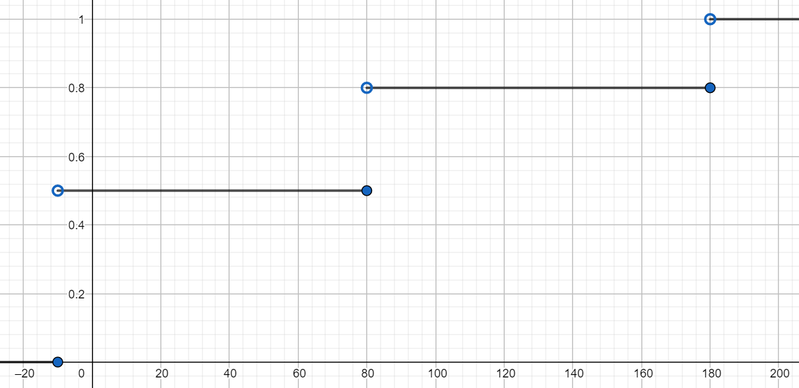

# Zmienne losowe dyskretne

## Zmienna losowa dyskretna
W skrócie jest to funkcja, która przypisuje liczby zdarzeniom elementarnym. Zmienna losowa jest określona na przestrzeni zdarzeń elementarnych a jej wartości są ze zbioru liczb rzeczywistych. Zmienna losowa jest dyskretna jeśli jej zbiór wartości jest dyskretny.

## Rozkład prawdopodobieństwa
Jest to miara probabilistyczna (nie będę wnikał co to jest) przypisująca prawdopodobieństwa zbiorom wartości danej zmiennej, odpowiadającym zdarzeniom elementarnym.

Dla zmiennej losowej dyskretnej możemy wprowadzić pojęcie funkcji prawdopodobieństwa: 

$$P(X=x_i) = p_i,$$

jest to prawdopodobieństwo kiedy zmienna losowa $X$ przyjmuje konkretną wartość $x_i$.

Przykład: 

Dla rzutów monetą funkcję prawdopodobieństwa można zobrazować jako tabelkę:

| |Zdarzenie | orzeł | reszka |
| --- | --- | --- | --- |
|Zmienna losowa | $x_i$ | 0 | 1 |
|Prawdopodobieństwo | $p_i$ | 0.5 | 0.5 |

## Dystrybuanta
Dystrybuantą zmiennej losowej $X$ nazywamy funkcję $F(x)$ określoną na zbiorze liczb rzeczywistych jako: 

$$F(x) = P(X \le x)$$

Dla zmiennej dyskretnej:

$$F(x) = P(X \le x) = \sum\limits_{x_i < x}{P(X = x_i) } =  \sum\limits_{x_i < x}p_i$$

## Wartość oczekiwana
Wartość oczekiwana zmiennej losowej $X$ określona jest wzorem:
$$E(X) = \sum\limits_{i=1}^n x_ip_i.$$

## Własności wartości oczekiwanej
* $E(c) = c,$
* $E(aX+b) = aE(X) + b,$
* $E(X + Y) = E(X) + E(Y),$
* $E(X - Y) = E(X) - E(Y),$
* $E(X_1+X_2+...+X_n)=E(X_1)+E(X_2)+...+E(X_n),$
* Jeżeli zmienne losowe $X$ i $Y$ są niezależne to $E(XY)=E(X)E(Y).$
* Twierdzenie LOTUS:

$$E[g(X)]=\sum\limits_{x_k∈R_X}g(x_k)P_X(x_k).$$

## Wariancja
Wariancja zmiennej losowej $X$ określona jest wzorem:

$$D^2(X) = \sum\limits_{i=1}^n [x_i - E(X)]^2 p_i,$$

można zapisać również:

$$D^2(X) = E\{[X - E(X)]^2\}.$$

## Własności wariancji
* $D^2(X)=E(X^2)-[E(X)]^2,$
* $D^2(c)=0,$
* $D^2(a\cdot X)=a^2\cdot D^2(X),$
* $D^{2}(X+b)=D^{2}(X),$
* jeżeli zmienne losowe $X$ i $Y$ są niezależne to $D^{2}(X\pm Y)=D^{2}(X)+D^{2}(Y),$
* $D^2(X) = E(X^2) - (E(X))^2.$

## Mediana
Kwantylem rzędu $p$, gdzie $0\le p\le 1$, w rozkładzie empirycznym $P_{X}$ zmiennej losowej $X$ nazywamy taką wartość $x_{p}$ zmiennej losowej $X$  dla której spełnione są nierówności:

$P_{X}((-\infty, x_{p}]) \ge p$

oraz

$P_{X}([x_{p}, \infty)) \ge 1 - p.$

Kwantyl rzędu $\frac{1}{2}$ to inaczej mediana.

## Dominanta
Dominanta to statystyka dla zmiennych o rozkładzie dyskretnym, wskazująca na wartość o największym prawdopodobieństwie wystąpienia.

## Rozkład dwumianowy, rozkład Bernoulliego
Dyskretny rozkład prawdopodobieństwa opisujący liczbę sukcesów $k$ w ciągu $n$ niezależnych prób, z których każda ma stałe prawdopodobieństwo sukcesu równe $p$. Pojedynczy eksperyment nosi nazwę próby Bernoulliego. Jeżeli zmienna losowa $X$ pochodzi z rozkładu dwumianowego to oznaczamy $X \sim B(n, p)$

Funkcja rozkładu prawdopodobieństwa:

$$P(X = k) = P_n(k) = {n \choose k}p^k(1-p)^{n - k}.$$

Wartość oczekiwana:

$$E(X) = np.$$

Wariancja:

$$D^2(X) = np(1 - p).$$

## Rozkład Poissona
Dyskretny rozkład prawdopodobieństwa, wyrażający prawdopodobieństwo szeregu wydarzeń mających miejsce w określonym czasie, gdy te wydarzenia występują ze znaną średnią częstotliwością $\lambda$ i w sposób niezależny od czasu jaki upłynął od ostatniego zajścia takiego zdarzenia. Rozkład Poissona można również stosować w odniesieniu do liczby zdarzeń w innych określonych przedziałach, takich jak odległość, powierzchnia lub objętość. Jeżeli zmienna losowa $X$ pochodzi z rozkładu Poissona to oznaczamy $X \sim Pois(\lambda)$ lub $X \sim P(\lambda)$

Funkcja rozkładu prawdopodobieństwa:

$$P(X = k) = f(k, \lambda) = \frac{\lambda^ke^{-\lambda}}{k!}.$$

Wartość oczekiwana:

$$E(X) = \lambda.$$

Wariancja:

$$D^2(X) = \lambda.$$

# Zadania

### Zadanie 1
Jurek i Krzysztof działają w kole naukowym. Jurek opuszcza 30% zebrań koła naukowego, a Krzysztof 40% zebrań. W ciągu miesiąca są 4 zebrania koła naukowego.\
a) Oblicz prawdopodobieństwo, że Jurek i Krzysztof spotkają się w miesiącu, jeżeli ich decyzje o przyjściu na zebranie w różnych tygodniach są niezależne.\
b) Znajdź funkcję prawdopodobieństwa liczby spotkań w miesiącu Jurka i Krzysztofa na zebraniach koła naukowego.\
c) Oblicz wartość oczekiwaną liczby spotkań Jurka i Krzysztofa, o których mowa w punkcie b).

Rozwiązanie

Szukam prawdopodobieństwa, że jurek i Krzysztof spotkają się na zebraniu, ponieważ decyzje są niezależne to:

$P = 0.7 \cdot 0.6 = 0.42,$

teraz można korzystać z rozkładu dwumianowego.

a)

Należy obliczyć prawdopodobieństwo, że nie spotkają się ani razu a następnie odjąć od 1:

$P(X > 0) = 1 - P(X = 0)$

```python
import scipy.stats as st
print("Szukane prawdopodobienstwo to: ", 1 - st.binom.pmf(0, 4, 0.42))
```

b)

Korzystając z rozkładu dwumianowego należu znaleźć kolejno prawdopodobieństwo, że spotkają się 0, 1, 2, 3, 4 razy:

```python
import scipy.stats as st
print("k = 0:", st.binom.pmf(0, 4, 0.42))
print("k = 1:", st.binom.pmf(1, 4, 0.42))
print("k = 2:", st.binom.pmf(2, 4, 0.42))
print("k = 3:", st.binom.pmf(3, 4, 0.42))
print("k = 4:", st.binom.pmf(4, 4, 0.42))
```

|||||||
|---|---|---|---|---|---|
|$x_i$|0|1|2|3|4|
|$p_i$|0.11|0.33|0.36|0.17|0.03|

c)

$E(X) = 0 \cdot 0.11 + 1 \cdot 0.33 + 2 \cdot 0.36 + 3 \cdot 0.17 + 4 \cdot 0.03 = 1.68,$

lub korzystając z rozkładu dwumianowego:

$E(X) = np = 4 \cdot 0.42 = 1.68.$

Rozwiązanie w pythonie:

```python
import scipy.stats as st

print("Wartosc oczekiwana: ", st.binom.stats(4, 0.42, moments='m'))
print("Wartosc oczekiwana: ", st.binom.mean(4, 0.42))
```

### Zadanie 2
Prawdopodobieństwo  wygrania w cotygodniowej grze losowej wynosi 0.005, a wielkość wygranej wynosi 10 jednostek pieniężnych.\
a) Jurek zagrał pięciokrotnie. Oblicz wartość oczekiwaną łącznej wygranej.\
b) Jurek postanowił grać w kolejnych tygodniach aż do momentu pierwszej porażki. Oblicz wartość oczekiwaną łącznej wygranej Jurka.

Rozwiązanie:

a)

Zmienna losowa $X$ opisująca wygrane w grze losowej pochodzi z rozkładu dwumianowego, ponieważ jest to suma doświadczeń Bernoulliego (w jednym doświadczeniu możliwe są tylko dwie sytuacje, wygrana lub przegrana). Możemy zapisać:

$X \sim B(5, 0.005).$

Ponieważ wielkość wygranej wynosi 10 to nowa zmienna losowa $Y$ opisująca wielkość wygranej ma postać:

$Y = 10X.$

Korzystając z własności wartości oczekiwanej oraz informacji o rozkładzie dwumianowym, mamy:

$E(Y) = E(10X) = 10E(X) = 10np = 10 \cdot 5 \cdot 0.005 = 0.25.$

Wartość oczekiwana łącznej wygranej w pięciu grach wynosi więc 0.25 jednostki pieniężnej.

b)

Niech $n$ oznacza liczbę kolejnych gier, $p$ - prawdopodobieństwo wygranej, wtedy prawdopodobieństwo $n-1$ wygranych i jednej porażki wynosi:

$P(X = n) = p^{n-1}(1-p)$ dla $n=1, 2, 3,...$

Biorąc pod uwagę wysokość wygranej:

$P(Y = n) = 10p^{n-1}(1-p)$ dla $n=1, 2, 3,...$

Wartość oczekiwana grania aż do pierwszej porażki to:

$E(Y) = \sum\limits_{k=1}^\infty x_k \cdot 10p^{k-1}(1-p) = 10(1-p)\sum\limits_{k=1}^\infty x_k p^{k-1},$

ponieważ $x_1 = 1, x_2 = 2,...,x_n = n$, to można zapisać:

$E(Y) = 10(1-p)\sum\limits_{k=1}^\infty kp^{k-1}.$

Korzystając z metody różniczkowania szeregu geometrycznego mamy:

$\sum\limits_{k=1}^\infty kp^{k-1} =
\sum\limits_{k=1}^\infty \left( k \frac{p^k}{k} \right)'=
\left( \sum\limits_{k=0}^\infty p^k \right)'$

Wzór na sumę szeregu geometrycznego to:

$\sum\limits_{k=1}^\infty aq^k = \frac{a_1}{1-q},$

gdzie $a_1$ to pierwszy wyraz szeregu, $q$ to iloraz szeregu.

Korzystając z powyższego wzoru:

$\sum\limits_{k=1}^\infty kp^{k-1} =
\left( \sum\limits_{k=1}^\infty p^k \right)'=
\left( \frac{p}{1-p} \right)' = \frac{1-p+p}{(1-p)^2} = \frac{1}{(1-p)^2},$

stąd:

$E(Y) = 10(1-p) \frac{1}{(1-p)^2} = \frac{10}{(1-p)}.$

### Zadanie 3
Liczba huraganów w pewnym rejonie Pacyfiku w ciągu roku jest zmienną losową o rozkładzie Poissona z wartością średnią 5.\
a) Oblicz prawdopodobieństwo, że w ciągu roku wystąpią mniej niż 3 huragany.\
b) Oblicz prawdopodobieństwo, że w ciągu roku wystąpi huragan.\
c) Znajdź wartość średnią i wariancję liczby huraganów w ciągu roku.\
d) Znajdź najbardziej prawdopodobną liczbę huraganów.

Rozwiązanie w Pythonie:

a) Należy skorzystać z dystrybuanty rozkładu Poissona.

```python
import scipy.stats as st

#cdf - cumulative distribution function czyli dystrybuanta
print("Szukane prawdopodobienstwo:", st.poisson.cdf(2, 5))
```

b) Obliczę, że w ciągu roku nie wystąpił żaden huragan i odejmę od 1.

```python
import scipy.stats as st

print("Szukane prawdopodobienstwo:", 1 - st.poisson.pmf(0, 5))
```

c) Obydwie wartości wynoszą 5, co wynika z własności rozkładu Poissona.

```python
import scipy.stats as st

print("Wartosc oczekiwana:", st.poisson.mean(5))
print("Wariancja:", st.poisson.var(5))
```

d) Narysuję wykres funkcji prawdopodobieństwa.

```python
import scipy.stats as st
import numpy as np
import pylab as py

x = np.linspace(0, 10, 11)
y = st.poisson.pmf(x, mu=5)

py.scatter(x, y)
py.show()
```

Najbardziej prawdopodobne jest 4 lub 5 huraganów.

### Zadanie 4
Liczba polis ubezpieczeniowych, które posiada losowo wybrany mieszkaniec dużego miasta jest zmienną losową $X$. Funkcję prawdopodobieństwa zmiennej losowej $X$ przedstawia tabela:

||||||
|---|---|---|---|---|
|$x_i$|0|1|2|3|
|$p_i$|0.1|0.3|0.4|c|

a) Oblicz stałą c.\
b) Oblicz prawdopodobieństwo, że losowo wybrany mieszkaniec miasta ma więcej niż jedną polisę.\
c) Znajdź dystrybuantę zmiennej losowej $X$.
d) Oblicz wartość oczekiwaną $E(X)$ oraz wariancję $D^2(X)$.

Rozwiązanie:

a)\
Aby dana funkcia była funkcją prawdopodobieństwa to suma $p_i$ musi wynosić 1, stąd:

$c = 1 - (0.1 + 0.3 + 0.4) = 1 - 0.8 = 0.2.$

b)\
Prawdopodobieństwo to jest sumą prawdopodobieństw posiadania 2 i 3 polis:

$P(X > 1) = 0.4 + 0.2 = 0.6.$

c)\
Należy sumować kolejne prawdopodobieństwa $p_i$:

|||||||
|---|---|---|---|---|---|
|x|$$(-\infty, 0]$$|$$(0,1]$$|$$(1,2]$$|$$(2,3]$$|$$(3, +\infty)$$|
|F(x)|0|0.1|0.4|0.8|1|

d)\
$E(X) = 0\cdot0.1 + 1\cdot0.3 + 2\cdot0.4 + 3\cdot0.2 = 1.7,$

$D^2(X) = (0-1.7)^2\cdot0.1 + (1-1.7)^2\cdot0.3 + (2-1.7)^2\cdot0.4 + (3-1.7)^2\cdot0.2$ = 0.81.

### Zadanie 5
Dla danych z zadania 4 oblicz $E(X|X>0)$, czyli wartość oczekiwaną liczby polis, które posiada losowo wybrana osoba, pod warunkiem, że posiada jakąkolwiek polisę.

Rozwiązanie:

$E(X|X>0) = \sum\limits_{i=1}^n x_i \frac{P(X = x_i \cap X>0)}{P(X>0)}$

$E(X|X>0) =  0\cdot\frac{0}{0.9} + 1\cdot\frac{0.3}{0.9} + 2\cdot\frac{0.4}{0.9} + 3\cdot\frac{0.2}{0.9} \approx 1.89$

### Zadanie 6
Zmienna losowa $X$ oznacza wygraną w pewnej grze losowej. Jej dystrybuanta to funkcja $F(x)$ postaci:

$
F(x) = 
\begin{cases}
0   & \text{dla $x < 0$,}           \\
0.5 & \text{dla $0 \le x < 100$,}   \\
0.8 & \text{dla $100 \le x < 200$,} \\
1   & \text{dla $x \ge 200$.}       \\
\end{cases}
$

a) Oblicz prawdopodobieństwo, że gracz nic nie wygra.\
b) Oblicz wartość średnią wygranej $E(X)$.\
c) Oblicz wariancję wygranej $D^2(X).$

Rozwiązanie:

a)\
Szukaną wartość można odczytać wprost z dystrybuanty:

$P(X = 0) = 0.5.$

b)\
Tutaj należy najpierw znaleźć funkcję prawdopodobieństwa co jest dość łatwe mając dystrybuantę należy odejmować od siebie odpowiednie prawdopodobieństwa:

|||||
|---|---|---|---|
|$x_i$|0|100|200|
|$p_i$|0.5|0.3|0.2|

$E(X) = 0\cdot0.5 + 100\cdot0.3 + 200\cdot0.2 = 70.$

c)\
$D^2(X) = (0-70)^2\cdot0.5 + (100-70)^2\cdot0.3 + (200-70)^2\cdot0.2 = 6100.$

### Zadanie 7
Niech $Y=0.9X-10$, gdzie $X$ jest zmienną losową z zadania 6.\
a) Oblicz wartość oczekiwaną $E(Y)$.\
b) Oblicz wariancję $D^2(Y)$.\
c) Wyznacz funkcję prawdopodobieństwa $f_Y$ zmiennej losowej $Y$.\
d) Wyznacz dystrybuantę $F_Y$ zmiennej losowej $Y$.\
e) Narysuj wykres funkcji $F_Y(y)$.

Rozwiązanie:

Skorzystam z własności wartości oczekiwanej i wariancji.

a)\
$E(Y) = E(0.9X-10) = 0.9E(X) - 10 = 0.9\cdot70 - 10 = 53.$

b)\
$D^2(Y) = D^2(0.9X-10) = 0.9^2\cdot D^2(X) = 0.9^2 \cdot 6100 = 4941.$

c)

|||||
|---|---|---|---|
|$y_i$|-10|80|170|
|$p_i$|0.5|0.3|0.2|

d)\
$F_Y(y) = 
\begin{cases}
0   & \text{dla } x \le -10,       \\
0.5 & \text{dla } -10 < x \le 80,  \\
0.8 & \text{dla } 80 < x \le 170,  \\
1   & \text{dla } x > 170.         \\
\end{cases}$

e)
<p align="center">

</p>

### Zadanie 8
Zmienna losowa $X$ ma funkcję prawdopodobieństwa daną w postaci tabeli:

||||||
|---|---|---|---|---|
|$x_i$|-2|-1|0|3|
|$p_i$|0.1|0.2|0.1|0.6|

Niech zmienna losowa $Y=X^2-1$.\
a) Oblicz wartość oczekiwaną $E(Y)$.\
b) Oblicz $P(Y>0)$.\
c) Znajdź funkcję prawdopodobieństwa zmiennej losowej Y.

Rozwiązanie:

a)\
$E(Y) = E(X^2 - 1) = E(X^2) - 1,$

$E(X^2) = \sum\limits_{i=1}^n x_i^2 p_i,$

$E(X^2) = 4\cdot0.1 + 1\cdot0.2 + 0\cdot0.1 + 9\cdot0.6 = 6,$

$E(Y) = E(X^2 - 1) = E(X^2) - 1 = 6 - 1 = 5.$

b)

$P(Y>0) = P(X^2-1>0) = P(X^2>1)$

Teraz trzeba znaleźć zmienną losową $X^2$:

||||||
|---|---|---|---|---|
|$x_i^2$|4|1|0|9|
|$p_i$|0.1|0.2|0.1|0.6|

$P(X^2>1) = 0.1 + 0.6 = 0.7$

c)

||||||
|---|---|---|---|---|
|$y_i$|3|0|-1|8|
|$p_i$|0.1|0.2|0.1|0.6|

### Zadanie 9
Załóżmy, że prawdopodobieństwo, że losowo wybrany łabędź ma wirusa typu H5 wynosi 0.001. Oblicz przybliżone prawdopodobieństwo, że wśród 500 losowo wybranych łabędzi znajdą się 2 z tym wirusem.

Rozwiązanie:

Można to obliczyć korzystając z rozkładu dwumianowego lub przybliżając wynik rozkładem Poissona.

```python
import scipy.stats as st

print(st.binom.pmf(2, 500, 0.001))
print(st.poisson.pmf(2, 0.001*500))
```

### Zadanie 10
Z urny zawierającej 3 kule białe i 6 czarnych losowo wyjęto dwie. Niech wartością zmiennej losowej $X$ będzie liczba wyjętych kul białych. Znaleźć funkcje prawdopodobieństwa i dystrybuantę zmiennej $X$ oraz obliczyć jej wariancje.

Rozwiązanie:

Korzystając z prawdopodobieństwa całkowitego można obliczyć prawdopodobieństwa wyjęcia 0, 1 lub 2 kul białych:

$P(X = 0) = \frac{6}{9} \cdot \frac{5}{8} = \frac{5}{12},$

$P(X = 1) = \frac{3}{9} \cdot \frac{6}{8} +  \frac{6}{9} \cdot \frac{3}{8}= \frac{1}{2},$

$P(X = 2) = \frac{3}{9} \cdot \frac{2}{8} = \frac{1}{12}.$

Funkcja prawdopodobieństwa:

|||||
|---|---|---|---|
|$x_i$|0|1|2|
|$p_i$|$\frac{5}{12}$|$\frac{1}{2}$|$\frac{1}{12}$|

Dystrybuanta:

|||||||
|---|---|---|---|---|---|
|x|$$(-\infty, 0]$$|$$(0,1]$$|$$(1,2]$$|$$(2, +\infty)$$|
|F(x)|0|$\frac{5}{12}$|$\frac{11}{12}$|1|

Wariancja:

$E(X) = \frac{1}{2} + 2\cdot\frac{1}{12} = \frac{2}{3},$

$E(X^2) = \frac{1}{2} + 4\cdot\frac{1}{12} = \frac{5}{6},$

$D^2(X)=E(X^2)-[E(X)]^2 = \frac{5}{6} - \left(\frac{2}{3}\right)^2 = \frac{7}{18} \approx 0.39.$

### Zadanie 11
Rozkład zmiennej losowej skokowej $X$ przedstawia tabela:

||||||
|---|---|---|---|---|
|$x_i$|1|$a$|3|4|
|$p_i$|0.1|0.4|0.3|$b$|

Wiadomo, że $E(X) = \frac{13}{5}$. Wyznaczyć $a$ i $b$ oraz obliczyć $D(X)$.

Rozwiązanie:

$b = 1 - 0.1 - 0.4 - 0.3 = 0.2.$

$\frac{13}{5} = 0.1 + a\cdot0.4 + 3\cdot0.3 + 4\cdot0.2,$

$\frac{13}{5} = 1.8 + 0.4a$

$a = 2.$

$E(X^2)=1\cdot0.1 + 4\cdot0.4 + 9\cdot0.3 + 16\cdot0.2 = 7.6,$

$D(X)=\sqrt{7.6 - 2.6^2} \approx 0.917.$

### Zadanie 12
Dana jest dystrybuanta zmiennej losowej skokowej X:

||||||||
|---|---|---|---|---|---|---|
|$x$|$$(−\infty, 0]$$|$$(0, 1]$$|$$(1, 2]$$|$$(2, 3]$$|$$(3, 4]$$|$$(4,+\infty)$$|
|$F(x)$|0|0.12|0.44|0.62|0.78|1|

a) Wyznaczyć jej funkcje rozkładu prawdopodobieństwa.\
b) Obliczyć $E(X)$ oraz $D(X)$.\
c) Obliczyć $P(1 < X \le 3)$, $P(X = 0.5)$, $P(X > 5)$.


Rozwiązanie:

a)

||||||||
|---|---|---|---|---|---|---|
|$x_i$|0|1|2|3|4|
|$p_i$|0.12|0.32|0.18|0.16|0.22|

b)\
$E(X) = 1\cdot0.32 + 2\cdot0.18 + 3\cdot0.16 + 4\cdot0.22 = 2.04,$

$E(X^2) = 1\cdot0.32 + 4\cdot0.18 + 9\cdot0.16 + 16\cdot0.22 = 6,$

$D(X)=E(X^2)-[E(X)]^2 = \sqrt{6 - 2.04^2} \approx 1.36.$

c)\
$P(1 < X \le 3) = P(X=2) + P(X=3) = 0.18 + 0.16 = 0.34,$

lub

$P(1 < X \le 3) = P(X \le 3) - P(X \le 1) = 0.78 - 0.44 = 0.34,$

$P(X = 0.5) = 0,$

bo nie ma takiego punktu,

$P(X > 5) = 0,$

bo również nie ma takiego punktu.

### Zadanie 13
Rzucamy 5 razy moneta. Niech zmienna losowa $X$ przyjmuje wartości równe liczbie wyrzuconych reszek. Znaleźć rozkład $X$ oraz obliczyć $D^2(X)$.

Rozwiązanie:

Zmienna losowa $X$ pochodzi z rozkładu dwumianowego, ponieważ mamy tutaj sumę 5 doświadczeń Bernoulliego.

$n = 5,$

$k \in \{0, 1, 2, 3, 4, 5\},$

$p =0.5.$


```python
import scipy.stats as st

for i in range(6):
  print(f"k = {i}:", st.binom.pmf(i, 5, 0.5))

print("Wariancja:", st.binom.var(5, 0.5))
```

### Zadanie 14
W partii składającej się z 6 detali znajdują się 4 detale standardowe. Losowo wybrano 3 detale. Znaleźć rozkład dyskretnej zmiennej losowej $X$ − liczby standardowych detali wśród wybranych. Obliczyć $E(X)$ i $D^2(X)$.


Rozwiązanie:

$P(X = 1) = 3 \cdot \frac{4}{6} \cdot \frac{2}{5} \cdot \frac{1}{4} = \frac{1}{5},$

$P(X = 2) = 3 \cdot \frac{4}{6} \cdot \frac{3}{5} \cdot \frac{2}{4} = \frac{3}{5},$

$P(X = 3) = \frac{4}{6} \cdot \frac{3}{5} \cdot \frac{2}{4} = \frac{1}{5},$

Druga metoda to:

$\Omega = {6 \choose 3} = 20,$

$P(X = 1) = \frac{{4 \choose 1} \cdot {2 \choose 2}}{20} = \frac{1}{5},$

$P(X = 2) = \frac{{4 \choose 2} \cdot {2 \choose 1}}{20} = \frac{3}{5},$

$P(X = 3) = \frac{{4 \choose 3} \cdot {2 \choose 0}}{20} = \frac{1}{5}.$

$E(X) = \frac{1}{5} + 2\cdot\frac{3}{5} +  3\cdot\frac{1}{5}= 2,$

$E(X^2) = \frac{1}{5} + 4\cdot\frac{3}{5} +  9\cdot\frac{1}{5}= 4.4,$

$D^2(X)=E(X^2)-[E(X)]^2 = 4.4 - 2^2 = 0.4.$

### Zadanie 15
W urnie znajduje się 8 kul, 3 białe i 5 czarnych. Wyciągamy losowo 3 kule. Niech zmienna losowa $X$ przyjmuje wartości równe liczbie wylosowanych kul czarnych. Znaleźć funkcję rozkładu prawdopodobieństwa zmiennej $X$.

Rozwiązanie:

$|\Omega| = {8 \choose 3} = 56,$

$P(X = 0) = \frac{{5 \choose 0} \cdot {3 \choose 3}}{56} = \frac{1}{56},$

$P(X = 1) = \frac{{5 \choose 1} \cdot {3 \choose 2}}{56} = \frac{15}{56},$

$P(X = 2) = \frac{{5 \choose 2} \cdot {3 \choose 1}}{56} = \frac{30}{56},$

$P(X = 3) = \frac{{5 \choose 3} \cdot {3 \choose 0}}{56} = \frac{10}{56}.$

### Zadanie 16
Zmienna losowa $X$ ma rozkład Poissona z parametrem $\lambda = 3$. Obliczyć $P(X ­\ge 3)$.

Rozwiązanie:

Korzystam z dystrybuanty rozkładu Poissona:

$P(X \ge 3) = 1 - P(X < 3).$

```python
import scipy.stats as st

print("Szukane prawdopodobienstwo:", 1 - st.poisson.cdf(2, 3))
```

### Zadanie 17
Zmienna losowa $X$ ma rozkład dwumianowy z wartością oczekiwaną 40 i wariancją 30. Znaleźć $n$ i $p$.


Rozwiązanie:

Wiadomo, że w rozkładzie dwumianowym:

$E(X) =np,$

$D^2(X) = np(1-p).$

$40 =np,$

$n = \frac{40}{p},$

$30 = \frac{40}{p}p(1-p),$

$p = \frac{1}{4},$

$n = \frac{40}{\frac{1}{4}} = 160.$

### Zadanie 18
Zmienna losowa $X$ ma rozkład Poissona z parametrem $\lambda = 2$. Znaleźć wariancję zmiennej losowej $Z = 2X − 3$.

Rozwiązanie:

Wiadomo, że w rozkładzie dwumianowym:

$D^2(Z) = D^2(2X-3) = 4D^2(X) = 4\cdot2=8.$

### Zadanie 19
Zmienna losowa $Z$ ma rozkład dwumianowy z parametrami $n = 10$, $p = \frac{1}{3}$. Obliczyć $P(Z > 2)$.


Rozwiązanie:

```python
import scipy.stats as st

print("Szukane prawdopodobienstwo:", 1 - st.binom.cdf(2, 10, 1/3))
```

### Zadanie 20
Rozkład zmiennej losowej skokowej $X$ przedstawia tabela:

|||||||
|---|---|---|---|---|---|
|$x_i$|10| a| 30| 40| 50|
|$p_i$| 0.1| 0.2| 0.3| 0.3| b|

Wiadomo, że $E(X) = 31$. Wyznaczyć $a$ i $b$ oraz obliczyć $D^2(X)$.

Rozwiązanie:

$b = 1-0.1-0.2-0.3-0.3=0.1.$

$31 = 10\cdot0.1 + a\cdot0.2 + 30\cdot0.3 + 40\cdot0.3 + 50\cdot0.1,$

$31 = 27 + 0.2a,$

$a = 20.$

$E(X^2) = 100\cdot0.1 + 400\cdot0.2 + 900\cdot0.3 + 1600\cdot0.3 + 2500\cdot0.1 = 1090.$

$D^2(X) = E(X^2) - [E(X)]^2 = 1090 - 31^2 = 129.$

### Zadanie 21
Zmienna losowa $Y$ ma rozkład Bernoulliego z parametrami $n = 900$, $p = 0.1$. Znaleźć odchylenie standardowe zmiennej losowej $X = 3Y + 2$.

Rozwiązanie:

$D^2(X) = D^2(3Y+2) = 9D^2(Y)=9np(1-p)=9\cdot900\cdot0.1\cdot0.9 = 729,$

$D(X) = \sqrt{D^2(X)} = 27.$

### Zadanie 22
Dwie rozróżnialne sześcienne kostki do gry rzucamy jednocześnie. Zmienna losowa X przyjmuje wartości równe wartości bezwzględnej różnicy oczek. Znaleźć:\
a) rozkład zmiennej X,\
b) medianę oraz dominantę zmiennej X.

Rozwiązanie:

a)

Najlepiej narysować tabelkę i odejmować kolejne oczka od siebie.

$|\Omega| = 6\cdot6=36$

|||||||||
|---|---|---|---|---|---|---|---|
|$x_i$|0|1|2|3|4|5|
|$p_i$|$\frac{6}{36}$|$\frac{10}{36}$|$\frac{8}{36}$|$\frac{6}{36}$|$\frac{4}{36}$|$\frac{2}{36}$|

b)\
Mediana $Me$ to liczba $x_i$ spełniająca poniższe równanie:

$P((-\infty, x_i]) \ge \frac{1}{2},$

$P((-\infty, 2]) = \frac{6}{36} + \frac{10}{36} + \frac{8}{36} = \frac{24}{36} \ge \frac{1}{2},$

$Me = 2.$

Dominanta $Dom$ to wartość zmiennej losowej, której prawdopodobieństwo wystąpienia jest największe:

$Dom = 1.$

### Zadanie 23
Na drodze ruchu pociągów znajdują się w znacznej odległości od siebie 4 semafory, z których każdy (wobec znacznej odległości niezależnie od innych) zezwala na przejazd z prawdopodobieństwem $p = 0.8$. Niech $X$ oznacza liczbę semaforów zezwalających na przejazd i poprzedzających pierwsze zatrzymanie lub stację docelową. Znaleźć:\
a) funkcje prawdopodobieństwa zmiennej losowej $X$,\
b) momenty centralne rzędu pierwszego, drugiego i trzeciego zmiennej $X$,\
c)$P(X > 2)$, $P(X = 3)$, $P(0 < X \le 4)$.

Rozwiązanie:

a)\
Funkcja prawdopodobieństwa w tym przypadku to:

$P(X=k) = \begin{cases}
p^k(1-p) & \text{dla } k \in \{0, 1, 2, 3\}  \\
p^k & \text{dla } k \in \{4\},\\
\end{cases}$

bo szukamy prawdopodobieństwa, że pociąg przejedzie przez $k$ semaforów i zostanie zatrzymany na kolejnym semaforze ale po 4 semaforze nie ma kolejnego żeby go zatrzymać.

$P(X = 0) = 0.8^0\cdot0.2 = 0.2,$

$P(X = 1) = 0.8^1\cdot0.2 = 0.16,$

$P(X = 2) = 0.8^2\cdot0.2 = 0.128,$

$P(X = 3) = 0.8^3\cdot0.2 = 0.1024,$

$P(X = 4) = 0.8^4 = 0.4096.$

b)\
Moment centralny rzędu $k$ (gdzie $k=1,2,...$) jest zdefiniowany następująco:

$E\{[X - E(X)]^k\} = \sum\limits_{i=1}^n [x_i-E(X)]^kp_i.$

Kod w Pythonie:

```python
def expected_value(x, p):
  result = 0
  for i, j in zip(x, p):
    result += i*j

  return result

def central_moment(x, p, ev, k):
  result = 0
  for i, j in zip(x, p):
    result += j*(i - ev)**k
  
  return result

x = [0, 1, 2, 3, 4]
p = [0.2, 0.16, 0.128, 0.1024, 0.4096]
ev = expected_value(x, p)

for i in range(1, 4):
  print(f"Moment centralny rzedu {i}:", central_moment(x, p, ev, i))
```

c)\
$P(X > 2) = 0.1024 + 0.4096 = 0.512,$, 

$P(X = 3) =  0.1024$, 

$P(0 < X \le 4) = 1 - 0.2 = 0.8.$

### Zadanie 24
Zmienna losowa $X$ przyjmuje trzy wartości: 0, 1 i 2. Wiadomo, ze $E(X)=1$ oraz $E(X^2) =1.5$. Wyznaczyć rozkład zmiennej $X$.

Rozwiązanie:

$\begin{cases}
1 = p_1 + 2p_2 \\
1.5 = p_1 + 4p_2
\end{cases}$

$\begin{cases}
p_1 = 1 - 2p_2 \\
1.5 = 1 - 2p_2 + 4p_2
\end{cases}$

$\begin{cases}
p_2 = 0.25 \\
p_1 = 0.5
\end{cases}$

$p_0 = 1- 0.5 - 0.25 = 0.25$

Rozkład zmiennej $X$:

|||||
|---|---|---|---|
|$x_i$|0|1|2|
|$p_i$|0.25|0.5|0.25|

### Zadanie 25
Z grupy 3 mężczyzn i 5-ciu kobiet losowo wybrano 2-osobowy zarząd. Niech wartością zmiennej losowej $X$ będzie liczba kobiet w zarządzie. Znaleźć funkcje rozkładu prawdopodobieństwa zmiennej $X$ oraz wyznaczyć medianę i dominantę.

Rozwiązanie:

$|\Omega| = {8 \choose 2} = 28$

$P(X = 0) = \frac{{5 \choose 0} \cdot {3 \choose 2}}{28} \approx 0.11$

$P(X = 1) = \frac{{5 \choose 1} \cdot {3 \choose 1}}{28} \approx 0.54$

$P(X = 2) = \frac{{5 \choose 2} \cdot {3 \choose 0}}{28} \approx 0.36$

Funkcje rozkładu prawdopodobieństwa zmiennej $X$: 

|||||
|---|---|---|---|
|$x_i$|0|1|2|
|$p_i$|0.11|0.54|0.36|

$P((-\infty, x_i]) \ge \frac{1}{2},$

$Me = 1,$

$Dom = 1.$

### Zadanie 26
W pewnym drzewostanie zebrano informacje o liczbie nabiegów korzeniowych:

|||||||
|---|---|---|---|---|---|
|$x_i$|0|1|2|3|4|
|$p_i$|0.1|0.3|0.3|0.2|0.1|

Niech $X$ oznacza liczbę nabiegów korzeniowych w losowo wybranym drzewie.\
a) Znaleźć dystrybuantę zmiennej $X$.\
b) Obliczyć $E(X)$ oraz $D^2(X)$.\
c) Obliczyć $P(X > 2)$, $P(1 \le X \le 4)$.

Rozwiązanie:

a)

||||||||
|---|---|---|---|---|---|---|
|$x$|$$(−\infty, 0]$$|$$(0, 1]$$|$$(1, 2]$$|$$(2, 3]$$|$$(3, 4]$$|$$(4,+\infty)$$|
|$F(x)$|0|0.1|0.4|0.7|0.9|1|

b)

```python
def expected_value(x, p):
  result = 0
  for i, j in zip(x, p):
    result += i*j

  return result

def central_moment(x, p, ev, k):
  result = 0
  for i, j in zip(x, p):
    result += j*(i - ev)**k
  
  return result

x = [0, 1, 2, 3, 4]
p = [0.1, 0.3, 0.3, 0.2, 0.1]
ev = expected_value(x, p)

print("Wartosc oczekiwana:", ev)
print("Wariancja:", central_moment(x, p, ev, 2))
```

c)\
$P(X > 2) = 0.3$, 

$P(1 \le X \le 4) = 0.9.$

### Zadanie 27
W partii złożonej z 10 produktów znajdują się 3 produkty wadliwe. Wybrano losowo 2 produkty. Znaleźć rozkład liczby produktów wadliwych (wśród wybranych), dystrybuantę i wartość oczekiwana.

Rozwiązanie:

$|\Omega| = {10 \choose 2} = 28,$

$P(X = 0) = \frac{{3 \choose 0} \cdot {7 \choose 2}}{45} \approx 0.47,$

$P(X = 1) = \frac{{3 \choose 1} \cdot {7 \choose 1}}{45} \approx 0.47$

$P(X = 2) = \frac{{3 \choose 2} \cdot {7 \choose 0}}{45} \approx 0.07$

Funkcje rozkładu prawdopodobieństwa zmiennej $X$: 

|||||
|---|---|---|---|
|$x_i$|0|1|2|
|$p_i$|0.47|0.47|0.07|

Dystrybuanta:

||||||
|---|---|---|---|---|
|$x$|$$(−\infty, 0]$$|$$(0, 1]$$|$$(1, 2]$$|$$(2, +\infty]$$|
|$F(x)$|0|0.47|0.93|1|

Wartość oczekiwana:

$E(X) = 0.47 + 2 \cdot 0.07 = 0.61.$

### Zadanie 28
Prawdopodobieństwo zajścia pewnego zdarzenia w pojedynczej próbie jest równe $p$. Próby przeprowadzane są dopóty, dopóki zdarzenie zajdzie. Znaleźć rozkład liczby przeprowadzonych prób oraz $E(X)$.

Rozwiązanie:

$P(X = n) = (1-p)^{n-1}p$ dla $n = 1, 2, 3,...$

$E(X) = \sum\limits_{k=1}^\infty k(1-p)^{k-1}p = p \sum\limits_{k=1}^\infty k(1-p)^{k-1},$

Aby obliczyć powyższą sumę można skorzystać z metody różniczkowania szeregu geometrycznego:

$x = 1 - p$

$\sum\limits_{k=1}^\infty kx^{k-1} = 
\sum\limits_{k=1}^\infty \left( k\frac{x^k}{k} \right)' = 
\left( \sum\limits_{k=1}^\infty x^k \right)' =
\left( \frac{x}{1-x} \right)' = \frac{1-x+x}{(1-x)^2}=\frac{1}{(1-x)^2} = \frac{1}{(1-1+p)^2} = \frac{1}{p^2},$

$E(X) = p\frac{1}{p^2} = \frac{1}{p}.$

### Zadanie 29
Rzucamy moneta aż do pierwszego wypadnięcia orła. Niech $X$ oznacza liczbę rzutów. Znaleźć rozkład $X$, dystrybuantę oraz $E(X)$.

Rozwiązanie:

Rozkład:

$P(X = n) = (1-p)^{n-1}p = p^n = 0.5^n$ dla $n = 1, 2, 3,...$

Dystrybuanta:

$P(X \le x) = 
\sum\limits_{i = 1}^n p_i =
\sum\limits_{i = 1}^n p^i = p\frac{1-p^n}{1-p}=1-0.5^n,$

$F(x)=
\begin{cases}
0       & \text{dla $x \in (-\infty, 1]$} \\
1-0.5^n & \text{dla $x \in (n, n+1], n=1, 2, 3...$} \\
\end{cases}$

Wartość oczekiwana:

$E(X) = \sum\limits_{k=1}^{\infty} kp^k =
p \sum\limits_{k=1}^{\infty} kp^{k-1} =
p \sum\limits_{k=1}^{\infty} \left( k\frac{p^k}{k} \right)' =
p \left( \sum\limits_{k=1}^{\infty} p^k \right)' =
p \left( \frac{p}{1-p} \right)' =
p \frac{1-p+p}{(1-p)^2} = \frac{p}{(1-p)^2} = \frac{1}{0.5} = 2.$

### Zadanie 30
Dana jest funkcja prawdopodobieństwa pewnej zmiennej $X$:

||||||||
|---|---|---|---|---|---|---|
|$x_i$|-5|-2|0|1|3|8|
|$p_i$|0.1|0.2|0.1|0.2|c|0.1|

Wyznaczyć:\
a) stałą $c$,\
b) dystrybuantę,\
c) $E(X)$, $D^2(X)$, $D(X)$,\
d) $P(X < 0)$, $P(X \le 0)$, $P(X < 4)$, $P(X \le 4)$, $P(−2 \le X < 4)$, $P(X = 2)$, $P(X = 3)$, $P(−6 < X \le 0)$, $P(1 < X \le 8)$.

Rozwiązanie:

a)

$c = 1 - 0.1 - 0.2 - 0.1 - 0.2 - 0.1 = 0.3$

b)

|||||||||
|---|---|---|---|---|---|---|---|
|$x$|$$(\infty,-5]$$|$$(-5,-2]$$|$$(-2, 0]$$|$$(0,1]$$|$$(1,3]$$|$$(3,8]$$|$$(8, +\infty)$$|
|$F(x)$|0|0.1|0.3|0.4|0.6|0.9|1|

c)

$E(X) = (-5)\cdot0.1 + (-2)\cdot0.2 + 0.2 + 3\cdot0.3 + 8\cdot0.1 = 1,$

$E(X^2) = 25\cdot0.1 + 4\cdot0.2 + 0.2 + 9\cdot0.3 + 64\cdot0.1 = 12.6,$

$D^2(X) = 12.6 - 1^2 = 11.6,$

$D(X) \approx 3.406.$

d)

$P(X < 0) = 0.3,$

$P(X \le 0) = 0.4,$

$P(X < 4) = 0.9,$

$P(X \le 4) = 0.9,$

$P(−2 \le X < 4) = 0.8,$

$P(X = 2) = 0,$

$P(X = 3) = 0.3,$

$P(−6 < X \le 0) = 0.4,$

$P(1 < X \le 8) = 0.4.$

### Zadanie 31
Dana jest dystrybuanta pewnej zmiennej losowej $X$:

$
F(x) =
\begin{cases}
0   & \text{dla } x \le 2, \\
0.3 & \text{dla } 2 < x \le 4, \\
0.7 & \text{dla } 4 < x \le 6, \\
0.9 & \text{dla } 6 < x \le 7, \\
1   & \text{dla } x > 7. \\
\end{cases}
$

Wyznaczyć rozkład, obliczyć $E(X)$, $D^2(X)$, $D(X)$, $P(X > 1)$, $P(X ­\ge 0.5)$, $P(−1 < X < 2)$, $P(X \ge­ 7)$.

Rozwiązanie:

||||||
|---|---|---|---|---|
|$x_i$|2|4|6|7|
|$p_i$|0.3|0.4|0.2|0.1|

$E(X) = 2\cdot0.3 + 4\cdot0.4 + 6\cdot0.2 + 7\cdot0.1 = 4.1,$

$E(X^2) = 4\cdot0.3 + 16\cdot0.4 + 36\cdot0.2 + 49\cdot0.1 = 19.7,$

$D^2(X) = 19.7 - 4.1^2 = 2.89,$

$D(X) = \sqrt{2.89} = 1.7,$

$P(X > 1) = 1,$

$P(X ­\ge 0.5)= 1,$

$P(−1 < X < 2) = 0,$

$P(X \ge­ 7) = 0.1.$

### Zadanie 32
Gramy z druga osobą, na przykład z bankierem w następująca grę: jeśli w rzucie kostka wypadnie parzysta liczba oczek, bankier płaci nam tyle złotych, ile wypadło na kostce, a jeśli nieparzysta - my płacimy bankierowi tyle, ile wypadło na kostce. Znaleźć rozkład kwoty uzyskanej przez nas w pojedynczym rzucie. Obliczając jej wartość oczekiwana rozstrzygnąć, czy można przypuszczać, że gra będzie dla nas opłacalna.

Rozwiązanie:


||||||||
|---|---|---|---|---|---|---|
|$x_i$|-5|-3|-1|2|4|6|
|$p_i$|$\frac{1}{6}$|$\frac{1}{6}$|$\frac{1}{6}$|$\frac{1}{6}$|$\frac{1}{6}$|$\frac{1}{6}$|

$E(X) = \frac{1}{2}.$

Możemy przypuszczać, że gra jest dla nas opłacalna.

### Zadanie 33
Wśród wszystkich dzieci szkolnych z pewnego województwa przeprowadzono ankietę: ile razy byłeś na wakacjach w ciągu ostatnich 4 lat. 20% odpowiedziało 0 razy, 14% − 1 raz, 43% − 2 razy, 19 % − 3, a reszta − 4. Zmienna $X$ jest określona jako: liczba wyjazdów na wakacje w ciągu ostatnich 4 lat. Znaleźć jej rozkład, obliczyć $E(X)$, $D^2(X)$, $P(X > 3)$, $P(X \le 1)$, $P(0 \le X \le 4)$.

Rozwiązanie:

|||||||
|---|---|---|---|---|---|
|$x_i$|0|1|2|3|4|
|$p_i$|0.2|0.14|0.43|0.19|0.04|

$E(X) = 1.73,$

$E(X^2) = 4.21,$

$D^2(X) = 4.21 - 1.73^2 = 1.2171,$

$P(X > 3) = 0.04,$

$P(X \le 1) = 0.34,$

$P(0 \le X \le 4) = 1.$

### Zadanie 34
Prawdopodobieństwo urodzenia się dziewczynki w pewnej populacji wynosi 0.51. W zbiorze rodzin posiadających troje dzieci określamy zmienna $X$ − liczba dziewczynek w rodzinie. Znaleźć rozkład $X$, obliczyć prawdopodobieństwo, że w rodzinie z trójką dzieci jest co najmniej jeden chłopiec.

Rozwiązanie:

Korzystam z rozkładu dwumianowego:

```python
import scipy.stats as st

for i in range(4):
  print(f"k = {i}:", st.binom.pmf(i, 3, 0.51))
```

Rozkłada prawdopodobieństwa:

||||||
|---|---|---|---|---|
|$x_i$|0|1|2|3|
|$p_i$|0.118|0.367|0.382|0.132|

Prawdopodobieństwo tego, że w rodzinie będzie co najmniej jeden chłopiec jest równe prawdopodobieństwu tego, że będzie mniej niż 3 dziewczynki:

$P(X < 3) = 0.867.$

### Zadanie 35
Zmienna losowa $X$ ma rozkład Poissona z parametrem $\lambda = 2$. Wyznaczyć kwartyle zmiennej $X$.

Rozwiązanie:

Kwartyle to kwantyle rzędu 25%, 50% i 75%:

```python
import scipy.stats as st

print("Q1:", st.poisson.ppf(0.25, 2))
print("Q2:", st.poisson.ppf(0.5, 2))
print("Q3:", st.poisson.ppf(0.75, 2))
```

### Zadanie 36
Korzystając z własności wartości oczekiwanej zmiennej losowej $X$ wykazać, że $D^2(X) = E(X^2) − [E(X)]^2$.

Rozwiązanie:

$D^2(X) = E\{[X-E(X)]^2\} = E\{X^2 - 2XE(X) +[E(X)]^2\} = E(X^2) - 2E(X)E[E(X)] + E\{[E(X)]^2 \} = E(X^2) - 2E(X)E(X) + [E(X)]^2 = E(X^2) - 2[E(X)]^2 + [E(X)]^2 = E(X^2) - [E(X)]^2$
