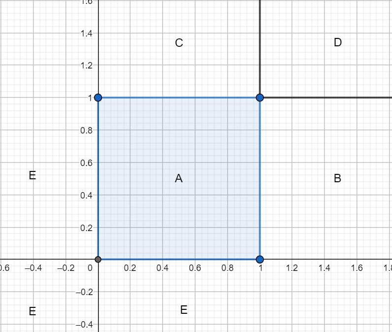

# Dwuwymiarowe zmienne losowe dyskretne

### Dwuwymiarowa zmienna losowa
Niech $X$ oraz $Y$ będą zmiennymi losowymi określonymi niekoniecznie na tej samej przestrzeni probabilistycznej. Parę $(X, Y)$ zmiennych losowych $X, Y$ nazywamy dwuwymiarową zmienną losową lub dwuwymiarowym wektorem losowym a $X$ oraz $Y$ jej współrzędnymi.

### Dystrybuantą dwuwymiarowej zmiennej losowej

Dystrybuantą dwuwymiarowej zmiennej losowej $(X, Y)$ nazywamy funkcję $F$ zmiennych $x, y$, która dla każdej pary liczb rzeczywistych $(x, y) \in \mathbb{R^2}$ przyjmuje wartości równe prawdopodobieństwu zdarzenia polegającego na tym, że zmienna losowa $X$ przyjmuje wartość mniejszą od $x$ i zmienna losowa $Y$ przyjmuje wartość mniejszą od $y$:

$$\begin{equation}F_{XY}(x,y) = P_{XY}(X < x, Y < y)\ \text{dla} \ (x, y) \in \mathbb{R^2}. \end{equation}$$

$F$ nazywamy także dystrybuantą łączną zmiennej losowej $(X, Y)$.

### Własności dystrybuanty

a) 

$$\begin{equation}\forall x\in\mathbb{R} \lim\limits_{y \to -\infty} F_{XY}(x, y) = 0, \ \ \ \ \ \forall y\in\mathbb{R} \lim\limits_{x \to -\infty} F_{XY}(x, y) = 0,\end{equation}$$

b) 

$$\begin{equation}\lim\limits_{x \to \infty \ y \to \infty} F_{XY}(x, y) = 1,\end{equation}$$

c) Dla dowolnych punktów: $(x_1, y_1)$, $(x_2, y_2)$ takich, że $x_1 \le x_2$ i $y_1 \le y_2$ zachodzi nierówność:

$$\begin{equation}F_{XY}(x_2, y_2) - F_{XY}(x_2, y_1) - F_{XY}(x_1, y_2) + F_{XY}(x_1, y_1) \ge 0.\end{equation}$$

d) Dystrybuanta jest funkcją niemalejącą i co najmniej lewostronnie ciągłą względem każdego z argumentów $x$ bądź $y$.

### Dwuwymiarowa zmienna losowa skokowa (dyskretna)

Dwuwymiarową zmienną losową $(X, Y)$, która przyjmuje skończoną, bądź przeliczalną liczbę wartości $(x_i, y_k)$, każdą odpowiednio z prawdopodobieństwem:

$$\begin{equation}P_{XY}(x, y) = P_{XY}(X = x_i, Y = y_k) = p_{ik} \text{ dla } i, k \in\mathbb{N},\end{equation}$$

przy czym $\sum\limits_{i} \sum\limits_{k} p_{ik} = 1,$ nazywamy dwuwymiarową zmienną losową skokową (dyskretną).

Dla każdego zbioru $A \in \mathbb{R^2}$:

$$\begin{equation}P_{XY}((X, Y) \in A) = 
\sum\limits_{a_i < i}\sum\limits_{a_k < k} P_{XY}(X = x_i, Y = y_k)=
\sum\limits_{a_i < i}\sum\limits_{a_k < k}p_{ik}.\end{equation}$$

Oznaczmy:

$$\begin{equation}p_{i.} = \sum\limits_{k}p_{ik} \ \ \text{dla} \ \ i \in\mathbb{N}, \end{equation}$$

$$\begin{equation}p_{.k} = \sum\limits_{i}p_{ik} \ \ \text{dla} \ \ k \in\mathbb{N}.\end{equation}$$

$p_{i.} = P_{XY}(X=x_i, Y=y_1) + P_{XY}(X=x_i, Y=y_2)+\dots$ jest prawdopodobieństwem tego, że zmienna losowa $X$ przyjmuje wartość równą $x_i$, bez względu na to, którą z wartości: $y_1, y_2,\dots$ przyjmuje zmienna losowa $Y$, oraz, że $\sum\limits_i p_{i.} = 1,$ a więc funkcja:

$$\begin{equation}P_X(X=x_i)=\sum\limits_{k} P_{XY}(X = x_i, Y = y_k)=p_{i.}, \ i\in\mathbb{N}\end{equation}$$

wyznacza rozkład prawdopodobieństwa zmiennej losowej $X$, nazywamy rozkładem brzegowym zmiennej $X$ w rozkładzie dwuwymiarowej zmiennej losowej $(X, Y)$. Analogicznie rozkład brzegowy zmiennej losowej $Y$ określamy wzorem:

$$\begin{equation}P_Y(Y=y_k)=\sum\limits_{i} P_{XY}(X = x_i, Y = y_k)=p_{.k}, \ \ k\in\mathbb{N}.\end{equation}$$

Jeśli dwuwymiarowa zmienna losowa $(X, Y)$ przyjmuje skończoną liczbę wartości, to wygodnie jest umieścić wartość funkcji prawdopodobieństwa w tabelce dwudzielczej:

|$y_k$ \ $x_i$|$x_1$|$x_2$|$...$|$x_m$|$p_{.k}$|
|---|---|---|---|---|---|
|$y_1$|$p_{11}$|$p_{21}$|$...$|$p_{m1}$|$p_{.1}$|
|$y_2$|$p_{12}$|$p_{22}$|$...$|$p_{m2}$|$p_{.2}$|
|$...$|$...$|$...$|$...$|$...$|$...$|
|$y_s$|$p_{1s}$|$p_{2s}$|$...$|$p_{ms}$|$p_{.s}$|
|$p_{i.}$|$p_{1.}$|$p_{2.}$|$...$|$p_{m.}$|$1$|

Oznaczmy przez $F_X$ i $F_Y$ dystrybuanty rozkładów brzegowych zmiennych losowych $X$ i $Y$ odpowiednio. Jeśli $(X, Y)$ jest dwuwymiarową zmienną losową skokową, to:

$$\begin{equation}F_X(x) = \sum\limits_{x_i < x}p_{i.} \ \text{ dla } \ x\in\mathbb{R}\end{equation}$$

$$\begin{equation}F_Y(y) = \sum\limits_{y_k < y}p_{.k} \ \text{ dla } \ y\in\mathbb{R}\end{equation}$$

### Dystrybuanty brzegowe

$$\begin{equation}F_X(x)=F_{XY}(x,∞)=\lim\limits_{y→∞}F_{XY}(x,y)\end{equation}$$

$$\begin{equation}F_Y(y)=F_{XY}(∞, y)=\lim\limits_{x→∞}F_{XY}(x,y)\end{equation}$$

### Warunkowanie zdarzeniem

Dla dyskretnej zmiennej losowej $X$ oraz zdarzenia $A$, gęstość $X$ pod warunkiem $A$ jest zdefiniowana jako:

$$\begin{equation}P_{X|A}(X=x_i)=P_{X|A}(X=x_i|A)=\frac{P_X(X=x_i, A)}{P(A)}, \ \ i \in \mathbb{N}.\end{equation}$$

Dystrybuanta $X$ pod warunkiem $A$:

$$\begin{equation}F_{X|A}(x)=P_{X|A}(X≤x|A) = \frac{P_X(X < x, A)}{P(A)}.\end{equation}$$

Warunkowa wartość oczekiwana:

$$\begin{equation}E[X|A]=\sum\limits_i x_iP_{X|A}(X=x_i|A).\end{equation}$$

### Warunkowanie zmienną losową

Dla dyskretnych zmiennych losowych $X$ oraz $Y$, gęstość $X$ pod warunkiem $Y$ jest zdefiniowana jako:

$$\begin{equation}P_{X|Y}(x_i|y_k)=P_{X|Y}(X=x_i|Y=y_k) = 
\frac{P_{XY}(X=x_i,Y=y_k)}{P_Y(Y = y_k)} =
\frac{p_{ik}}{p_{.k}}.\end{equation}$$

Gęstość $Y$ pod warunkiem $X$:

$$\begin{equation}P_{Y|X}(y_i|x_k)=P_{Y|X}(Y=y_k|X=x_i) =
\frac{P_{XY}(X=x_i,Y=y_k)}{P_Y(X = x_i)}=
 \frac{p_{ik}}{p_{i.}}.\end{equation}$$

Dystrybuanty rozkładów warunkowych oznaczamy odpowiednio przez: $F_{X|Y}(x|y_k), \ F_{Y|X}(y|x_i)$ i wyznaczamy ze wzorów:

$$\begin{equation}F_{X|Y}(x|y_k) = P_{X|Y}(X < x|Y=y_k) = \sum\limits_{x_i < x} \frac{p_{ik}}{p_{.k}},\end{equation}$$

$$\begin{equation}F_{Y|X}(y|x_i) = P_{Y|X}(Y < y|X=x_i) = \sum\limits_{y_k < y} \frac{p_{ik}}{p_{i.}}.\end{equation}$$

Warunkowa wartość oczekiwana:

$$\begin{equation}E[X|Y=y]=\sum\limits_i x_iP_{X|Y}(x_i|y).\end{equation}$$

### LOTUS

$$\begin{equation}E[g(X,Y)]=\sum\limits_i \sum\limits_k g(x_i, y_k)P_{XY}(X=x_i, Y=y_k).\end{equation}$$

### Niezależność zmiennych losowych

Zmienne losowe $X$ i $Y$ typu skokowego są niezależne wtedy i tylko wtedy, gdy

$$\begin{equation}P_{XY}(x, y) = P_X(x)P_Y(y) \ \text{ dla każdego } \ x, y,\end{equation}$$

czyli:

$$\begin{equation}p_{ik} = p_{i.}p_{.k} \ \text{ dla } \ i,k\in\mathbb{N}.\end{equation}$$

Równoważnie, $X$ oraz $Y$ są niezależne gdy:

$$\begin{equation}F_{XY}(x,y)=F_X(x)F_Y(y) \ \text{ dla każdego } \ x, y.\end{equation}$$

### Prawdopodobieństwo całkowite

$$\begin{equation}P(X \in A)=\sum\limits_k P(X \in A|Y=y_k)P_Y(Y=y_k), \ \text{ dla każdego zbioru } \ A.\end{equation}$$

### Całkowita wartość oczekiwana

Jeżeli $B_1$, $B_2$, $B_3$,... są podziałami przestrzeni zdarzeń $S$:

$$\begin{equation}EX=\sum\limits_i E[X|B_i]P(B_i).\end{equation}$$

Dla zmiennej losowej $X$ oraz dyskretnej zmiennej losowej $Y$:

$$\begin{equation}EX=\sum\limits_k E[X|Y=y_k]P_Y(Y = y_k).\end{equation}$$

### Warunkowa wartość oczekiwana jako zmienna losowa

Możemy powiedzieć, że $E[X|Y=y]$ jest funkcją $y$ co możemy zapisać jako $g(y)=E[X|Y=y]$. Stąd możemy myśleć o $g$ jako o funkcji z wartościami pochodzącymi ze zmiennej $Y$. Możemy więc napisać, że $g(Y)=E[X|Y]$. Używamy powyższej notacji aby zaznaczyć, że $E[X|Y]$ jest zmienną losową, której wartości są równe $g(y)=E[X|Y=y]$ kiedy $Y=y$. Stąd, jeżeli $Y$ jest zmienną losową to $E[X|Y]$ jest również zmienną losową:

$$\begin{equation}E[X|Y]=\begin{cases}
E[X|Y=y_1] & \text{ z prawdopodobieństwem } P(Y=y_1) \\
E[X|Y=y_2] & \text{ z prawdopodobieństwem } P(Y=y_2) \\
\ \ \ \ \ \ \ \ \ \ \ \ .& \ \ \ \ \ \ \ \ \ \ \ \ \ \ \ \ \ \ \ \ \ \ \ \ \ \ \ \ . \\
\ \ \ \ \ \ \ \ \ \ \ \ .& \ \ \ \ \ \ \ \ \ \ \ \ \ \ \ \ \ \ \ \ \ \ \ \ \ \ \ \ . \\
\ \ \ \ \ \ \ \ \ \ \ \ .& \ \ \ \ \ \ \ \ \ \ \ \ \ \ \ \ \ \ \ \ \ \ \ \ \ \ \ \ .
\end{cases}\end{equation}$$

### Wzory wartość oczekiwana

$$\begin{equation}E[g(X)h(Y)|X]=g(X)E[h(Y)|X],\end{equation}$$

$$\begin{equation}E[X]=E[E[X|Y]],\end{equation}$$

$$\begin{equation}E\left[\sum\limits_{i=1}^nX_i \right] = \sum\limits_{i=1}^n EX_i.\end{equation}$$

Dla niezależnych zmiennych losowych $X$ oraz $Y$:

$$\begin{equation}E[X|Y]=EX,\end{equation}$$

$$\begin{equation}E[g(X)|Y]=E[g(X)],\end{equation}$$

$$\begin{equation}E[XY]=EXEY,\end{equation}$$

$$\begin{equation}E[g(X)h(Y)]=E[g(X)]E[h(Y)].\end{equation}$$

### Wzory wariancja

Dla niezależnych zmiennych losowych $X$ oraz $Y$:

$$\begin{equation}Var\left(\sum\limits_{i=1}^nX_i \right) = \sum\limits_{i=1}^n Var(X_i),\end{equation}$$

$$\begin{equation}Var(X|Y) = Var(X).\end{equation}$$

### Warunkowa wariancja

Niech $μ_{X|Y}(y)=E[X|Y=y]$:

$$Var(X|Y=y)=E[(X−μ_{X|Y}(y))^2|Y=y]=\sum\limits_i (x_i−μ_{X|Y}(y))^2 P_{X|Y}(x_i)$$

$$\begin{equation} = E[X^2|Y=y]−μ_{X|Y}(y)^2 = E[X^2|Y=y]−[E[X|Y=y]]^2.\end{equation}$$

### Wariancja całkowita

$$\begin{equation}Var(X)=E[Var(X|Y)]+Var(E[X|Y]).\end{equation}$$

# Zadania

### Zadanie 1

Rozkład łączny wektora losowego $(X, Y)$ podany jest w tabeli:

|$y_k$ \ $x_n$|0|2|
|---|---|---|
|-2|0.1|0.2|
|0|0|0.2|
|1|0.2|0.3|

Wyznaczyć rozkłady brzegowe tego wektora losowego. Sprawdzić, czy zmienne losowe $X$ i $Y$ są niezależne.

Rozwiązanie:

Należy sumować odpowiednie wiersze i kolumny w tabelce:

|$y_k$ \ $x_n$|0|2|$p_{.k}$|
|---|---|---|---|
|-2|0.1|0.2|0.3|
|0|0|0.2|0.2|
|1|0.2|0.3|0.5|
|$p_{i.}$|0.3|0.7|1|

Zmienne nie są niezależne bo np. $P(X=0, Y=0) = 0 \ne 0.6 = P(X=0)P(Y=0)$.

### Zadanie 2

Dwuwymiarowa zmienna losowa $(X, Y)$ ma rozkład określony w tabelce:

|$y_k$ \ $x_i$|1|2|3|
|---|---|---|---|
|2    |0.1|0.2|0.3|
|4    |0.1|0.1|0.2|

Wyznaczyć dystrybuantę rozkładu brzegowego zmiennej losowej $Y$.

Rozwiązanie:

Wyznaczę najpierw rozkład prawdopodobieństwa zmiennej $Y$, trzeba tylko posumować wiersze z tabelki:

|$y_k$|2|4|
|---|---|---|
|$p_{.k}$|0.6|0.4|

Dystrybuantę wyznacza się teraz dla pojedynczej zmiennej losowej zgodnie ze wzorem nr (9) i jest to:

$$F_2(y) = \begin{cases}
0   & \text{dla } y \le 2, \\
0.6 & \text{dla } 2 < y \le 4, \\
1   & \text{dla } y > 4. \\
\end{cases}$$

### Zadanie 3

Rozważmy dwie zmienne losowe $X$ i $Y$ których gęstość łączna przedstawiona jest w poniższej tabeli:

|$x_i$ \ $y_k$|0|1|2|$p_{.k}$|
|---|---|---|---|---|
|0|$\frac{1}{6}$|$\frac{1}{4}$|$\frac{1}{8}$|$\frac{13}{24}$|
|1|$\frac{1}{8}$|$\frac{1}{6}$|$\frac{1}{6}$|$\frac{11}{24}$|
|$p_{i.}$|$\frac{7}{24}$|$\frac{5}{12}$|$\frac{7}{24}$|1|

a) Oblicz $P(X=0,Y \le 1)$.

b) Znajdź rozkłady brzegowe $X$ i $Y$.

c) Znajdź $P(Y=1|X=0)$.

d) Czy $X$ i $Y$ są niezależne?

Rozwiązanie:

a) $P(X=0,Y \le 1) = \frac{1}{6} + \frac{1}{4} = \frac{5}{12}.$

b) Dopisałem do tabeli w treści zadania.

c) $P(Y=1|X=0) = \frac{P(Y=1,X=0)}{P(X = 0)} = \frac{\frac{1}{4}}{\frac{13}{24}} = \frac{6}{13}.$

d) Zmienne nie są niezależne bo $p_{.0}p_{0.} \ne p_{00}.$

### Zadanie 4

Rozważmy dwie zmienne losowe $X$ oraz $Y$ z funkcją prawdopodobieństwa podaną w tabeli.

||$Y=2$|$Y=4$|$Y=5$|$p_{.k}$|
|---|---|---|---|---|
|$X=1$|$\frac{1}{12}$|$\frac{1}{24}$|$\frac{1}{24}$|$\frac{1}{6}$|
|$X=2$|$\frac{1}{6}$|$\frac{1}{12}$|$\frac{1}{8}$|$\frac{3}{8}$|
|$X=3$|$\frac{1}{4}$|$\frac{1}{8}$|$\frac{1}{12}$|$\frac{11}{24}$|
|$p_{i.}$|$\frac{1}{2}$|$\frac{1}{4}$|$\frac{1}{4}$|1|

a) Znajdź $P(X \le 2, Y \le 4)$.

b) Znajdź rozkłady brzegowe zmiennych $X$ oraz $Y$.

c) Znajdź $P(Y=2|X=1)$.

d) Czy $X$ i $Y$ są niezależne?

Rozwiązanie:

a) $P(X \le 2, Y \le 4) = P_{XY}(1,2)+P_{XY}(1,4)+P_{XY}(2,2)+P_{XY}(2,4)=\frac{1}{12} + \frac{1}{24} + \frac{1}{6} + \frac{1}{12} = \frac{3}{8}.$

b) Dopisałem w tabeli powyżej.

c) $P(Y=2|X=1) = \frac{P_{XY}(X=1, Y=2)}{P_X(X=1)} = \frac{\frac{1}{12}}{\frac{1}{6}} = \frac{1}{2}.$

d) Zmienne nie są niezależne bo:

$P_{XY}(X=2,Y=2)=\frac{1}{6} \ne P_X(X=2)P_Y(Y=2)=\frac{3}{16}.$

### Zadanie 5

Niech dwuwymiarowa zmienna losowa $(X, Y)$ ma rozkład podany w tabelce:

|$y_k$ \ $x_i$|2|3|3.5|4|5|
|---|---|---|---|---|---|
|2      |$\frac{3}{35}$|$\frac{2}{35}$  |$\frac{1}{35}$|0             |0             |
|3      |$\frac{1}{35}$|$\frac{10}{35}$ |$\frac{2}{35}$|$\frac{1}{35}$|0             |
|3.5    |0               |$\frac{1}{35}$|$\frac{5}{35}$|$\frac{1}{35}$|$\frac{1}{35}$|
|4      |0               |0             |0             |$\frac{3}{35}$|$\frac{2}{35}$|
|5      |0               |0             |0             |$\frac{1}{35}$|$\frac{1}{35}$|

gdzie $X$ jest oceną klasówki z matematyki losowo wybranego ucznia pewnej klasy, $Y$ zaś oceną klasówki z fizyki. Wyznaczyć rozkład warunkowy zmiennej losowej $Y$ pod warunkiem, że $X=4$.

Rozwiązanie:

Mamy:

$p_{4.}=P(X=4)=\frac{6}{35}.$

Teraz:

$P(Y=y_k|X=4) = \frac{P(Y=y_k, X=4)}{P(X=4)} = \frac{P(Y=y_k, X=4)}{\frac{6}{35}},$

$P(Y=2|X=4) = 0,$

$P(Y=3|X=4) = \frac{1}{6},$

$P(Y=3.5|X=4) = \frac{1}{6},$

$P(Y=4|X=4) = \frac{3}{6},$

$P(Y=5|X=4) = \frac{1}{6}.$

### Zadanie 6

Z talii 52 kart wylosowano 1 kartę. Niech zmienna losowa $X$ przyjmuje wartości równe liczbie wylosowanych asów, zaś $Y$ - liczbę wylosowanych pików. Wyznaczyć rozkład prawdopodobieństwa dwuwymiarowej zmiennej losowej $(X, Y)$ i rozkłady brzegowe. Czy zmienne są niezależne?

Rozwiązanie:

Ponieważ losujemy tylko 1 kartę, każda ze zmiennych $X$, $Y$ może przyjmować z dodatnim prawdopodobieństwem tylko dwie wartości 0 albo 1.

Oznaczmy możliwe zdarzenia:

$A$ - wylosowanie asa pik,

$B$ - wylosowanie pika, który nie jest asem,

$C$ - wylosowanie asa, który nie jest pikiem,

$D$ - wylosowanie karty, która nie jest asem i nie jest pikiem.

$P(A) = P(X=1,Y=1) = \frac{1}{52},$

$P(B) = P(X=0,Y=1) = \frac{12}{52},$

$P(C) = P(X=1,Y=0) = \frac{3}{52},$

$P(D) = P(X=0,Y=0) = \frac{36}{52}.$

|$y_k$ \ $x_n$|0|1|$p_{.k}$|
|---|---|---|---|
|0|$\frac{36}{52}$|$\frac{3}{52}$|$\frac{39}{52}$|
|1|$\frac{12}{52}$|$\frac{1}{52}$|$\frac{13}{52}$|
|$p_{\text{i.}}$|$\frac{48}{52}$|$\frac{4}{52}$|1|

Zmienne są niezależne, ponieważ dla każdej ustalonej wartości $X$ i $Y$:

$P(X,Y) = P(X)P(Y)$, np.:

$P(X=0,Y=0) = \frac{36}{52} = \frac{48}{52} \cdot \frac{39}{52} = P(X=0)P(Y=0)$

### Zadanie 7

Pewien mechanizm składa się z dwóch kół zębatych: dużego i małego. Warunki techniczne przy montażu urządzenia zostają naruszone, jeśli w obu kołach występują dodatnie odchylenia grubości zębów od nominalnego wymiaru. Robotnik dysponuje 2 kołami zębatymi dużymi: "plusowym" i "minusowym" i dwoma małymi "plusowym" i "minusowym". Rozważmy zero-jedynkowe zmienne losowe $X$ i $Y$: zmienna losowa $X$ przyjmuje wartość 1, jeśli robotnik wylosuje duże koło "plusowe" i 0 jeśli duże koło "minusowe". Analogicznie określona jest zmienna losowa $Y$ w przypadku koła małego.

a) Wyznaczyć dystrybuantę $F$ dwuwymiarowej zmiennej losowej $(X, Y)$.

b) Obliczyć prawdopodobieństwo naruszenia warunków technicznych przy montażu mechanizmu.

Rozwiązanie:

a)

Na początku wyznaczę rozkład zmiennej losowej $(X, Y)$. Zmienna $(X, Y)$ przyjmuje wartości $(0, 0), (1, 0), (0, 1), (1, 1)$ z prawdopodobieństwami:

$P(X = 0, Y = 0) = \frac{1}{2}\cdot\frac{1}{2} = \frac{1}{4},$

$P(X = 1, Y = 0) = \frac{1}{2}\cdot\frac{1}{2} = \frac{1}{4},$

$P(X = 0, Y = 1) = \frac{1}{2}\cdot\frac{1}{2} = \frac{1}{4},$

$P(X = 1, Y = 1) = \frac{1}{2}\cdot\frac{1}{2} = \frac{1}{4}.$

W tabeli wygląda to następująco:

|$y_k$ \ $x_i$|0|1|
|---|---|---|
|0|$\frac{1}{4}$|$\frac{1}{4}$|
|1|$\frac{1}{4}$|$\frac{1}{4}$|

Korzystając z wzoru nr (1) wyznaczam dystrybuantę:

|$y$ \ $x$|$(-\infty, 0]$|$(0,1]$|$(1, \infty)$|
|---|---|---|---|
|$(-\infty,0]$|0|0            |0            |
|$(0, 1]$     |0|$\frac{1}{4}$|$\frac{1}{2}$|
|$(1,\infty)$ |0|$\frac{1}{2}$|1            |

b)

Naruszenie warunków technicznych montażu nastąpi wtedy, gdy robotnik wybierze losowo duże koło zębate plusowe i małe koło plusowe:

$P(X = 1, Y = 1) = \frac{1}{2}\cdot\frac{1}{2} = \frac{1}{4}$.

### Zadanie 8

Rzucamy jedną kostką do gry. Niech zmienna losowa $X$ przyjmuje wartość 0, gdy wyrzucimy parzystą liczbę oczek (zdarzenie $A$), oraz wartość 1, gdy wyrzucimy nieparzystą liczbę oczek ($A'$), zmienna losowa $Y$ przyjmuje wartość 1, gdy liczba rzuconych oczek jest podzielna przez 3 ($B$), oraz wartość 2, gdy liczba oczek nie jest podzielna przez 3 ($B'$). Zbadać niezależność zmiennych losowych $X$ i $Y$.

Rozwiązanie:

Dwuwymiarowa zmienna losowa $(X, Y)$ przyjmuje wartości: $(0,1)$, $(0,2)$, $(1,1)$, $(1,2)$ z prawdopodobieństwami:

$P(X=0, Y=1) = P(A \cap B) = \frac{1}{6},$

$P(X=0, Y=2) = P(A \cap B') = \frac{2}{6} = \frac{1}{3},$

$P(X=1, Y=1) = P(A' \cap B) = \frac{1}{6},$

$P(X=1, Y=2) = P(A' \cap B') = \frac{2}{6} = \frac{1}{3}.$

Przedstawiam otrzymane wyniki w tabelce dwudzielczej i wyznaczam rozkłady brzegowe poszczególnych zmiennych

|$y_k$ \ $x_i$  |0            |1            |$p_{.k}$     |
|---|---|---|---|
|1       |$\frac{1}{6}$|$\frac{1}{6}$|$\frac{1}{3}$|
|2       |$\frac{1}{3}$|$\frac{1}{3}$|$\frac{2}{3}$|
|$p_{i.}$|$\frac{1}{2}$|$\frac{1}{2}$|1            |

Zauważmy, że dla $\underset{i = 1, 2 \ k = 1, 2}{\forall} \ p_{ik} = p_{i.}p_{.k}$, a więc $X$, $Y$ są niezależnymi zmiennymi losowymi.

### Zadanie 9

Niech zmienne losowe $X$ i $Y$ mają rozkłady zero-jedynkowe o parametrach odpowiednio $p$ i $q$, gdzie $0 < p, q < 1$ oraz będą niezależne. Znajdź łączną gęstość prawdopodobieństwa oraz łączną dystrybuantę zmiennych losowych $X$ i $Y$.

Rozwiązanie:

Zmienne losowe $X$ i $Y$ przyjmują wartości 0 oraz 1. Wszystkie możliwe kombinacje to:

$R_{XY}=\{(0,0),(0,1),(1,0),(1,1)\}.$

Ponieważ zmienne losowe $X$ i $Y$ są niezależne to:

$p_{ik} = p_{i.}p_{.k} \ \text{ dla } \ i,k=0,1.$

Ostatecznie:

$P(0,0)=P_X(0)P_Y(0)=(1−p)(1−q),$

$P(0,1)=P_X(0)P_Y(1)=(1−p)q,$

$P(1,0)=P_X(1)P_Y(0)=p(1−q),$

$P(1,1)=P_X(1)P_Y(1)=pq.$

Teraz obliczę dystrybuantę:

$F_{XY}(x,y)=P(X≤x,Y≤y).$

1. $(x, y) \in A$

    $F_{XY}(x,y)=P(X \le x,Y \le y)=P(X=0,Y=0)=P(X=0)P(Y=0)=(1−p)(1−q).$

2) $(x, y) \in B$

    $F_{XY}(x,y)=P(X \le x,Y \le y)=P(X \le 1,Y=0)=P(Y=0)=1−q.$

3) $(x, y) \in C$

    $F_{XY}(x,y)=P(X \le x,Y \le y)=P(X=0,Y \le 1)=P(X=0)=1−p.$

4) $(x, y) \in D$

    $F_{XY}(x,y)=P(X \le x,Y \le y)=P(X \le 1,Y \le 1)=1.$

5) $(x, y) \in E$

    $F_{XY}(x, y) = 0$

Ostatecznie:

$$F_{XY}(x, y) = \begin{cases}
0          & E=\{(x,y): x < 0 \vee y < 0\}, \\
(1−p)(1−q) & A=\{(x,y): 0 \le x < 1  \wedge 0 \le y < 1\}, \\
1−q        & B=\{(x,y): x \ge 1  \wedge 0 \le y < 1\}, \\
1−p        & C=\{(x,y): 0 \le x < 1  \wedge y \ge 1\}, \\
1          & D=\{(x,y): x \ge 1 \wedge y \ge 1\}, \\
\end{cases}$$

### Zadanie 10

Dwuwymiarowa zmienna losowa $(X,Y)$ charakteryzuje losowo wybranego w pewnym miesiącu klienta banku. Zmienna losowa $X$ oznacza liczbę rodzajów funduszy inwestycyjnych, które posiada klient, natomiast zmienna losowa $Y$ przyjmuje wartość $y=1$, jeśli klient posiada jakąkolwiek lokatę, a $y=0$, gdy klient nie posiada lokaty. Funkcję prawdopodobieństwa łącznego zmiennej $(X,Y)$ określa tabela:

|$y_k$ \ $x_i$  |0   |1   |2   |3   |$p_{.k}$|
|---|---|---|---|---|---|
|0       |0.02|0.07|0.06|0.01|0.16|
|1       |0.01|0.5 |0.3 |0.03|0.84|
|$p_{i.}$|0.03|0.57|0.36|0.04|1   |

a) Oblicz prawdopodobieństwo warunkowe, że losowo wybrany klient posiada jakikolwiek fundusz inwestycyjny, jeśli wiadomo, że nie ma on lokaty.

b) Oblicz wariancję $Var(X)$.

c) Czy zmienne losowe $X$, $Y$ są niezależne.

d) Znajdź $F(1, 1.5)$.

Rozwiązanie:

a)

$P(X \ge 1 | Y=0) = \frac{P(X \ge 1, Y=0)}{P(Y=0)} = \frac{P(1, 0)+P(2, 0) + P(3, 0)}{P(Y=0)} = \frac{0.07+0.06+0.01}{0.16} = \frac{0.14}{0.16} = 0.875$

b)

$E(X) = 0\cdot0.03 + 1\cdot0.57 + 2\cdot0.36 + 3\cdot0.04 = 1.41,$

$E(X^2) = 0^2\cdot0.03 + 1^2\cdot0.57 + 2^2\cdot0.36 + 3^2\cdot0.04 = 2.37,$

$Var(X) = 2.37 - 1.41^2 = 0.3819.$

c)

$0.02 \ne 0.01\cdot0.16$

Więc zmienne losowe nie są niezależne.

d)

$F(1, 1.5) = P(X \le 1, Y \le 1.5) = 0.02 + 0.07 + 0.01 + 0.5 = 0.6$.

### Zadanie 11

Rzucamy kością do gry. Niech $X$ będzie liczbą wyrzuconych oczek. Znajdź gęstość $X$ pod warunkiem, że wyrzucona liczba oczek będzie mniejsza niż 5.

Rozwiązanie:

Korzystam z:

$P_{X|A}(X=x_i|A) = P_{X|A}(X=x_i|X<5)=\frac{P_X(X=x_i, X < 5)}{P(X < 5)},$

$P(A) = P(X < 5) = \frac{4}{6}$

$P_{X|A}(X=1|X < 5)=\frac{P_X(X=1, X < 5)}{P(X < 5)} = \frac{\frac{1}{6}}{\frac{4}{6}} = \frac{1}{4},$

$P_{X|A}(X=1|X < 5) = P_{X|A}(X=2|X < 5) = P_{X|A}(X=3|X < 5) = P_{X|A}(X=4|X < 5) = \frac{1}{4}$

$P_{X|A}(X=5|X < 5)=\frac{P_X(X=5, X < 5)}{P(X < 5)} = \frac{0}{\frac{4}{6}} = 0,$

$P_{X|A}(X=5|X < 5) = P_{X|A}(X=6|X < 5) = 0.$

### Zadanie 12

Rozważmy zbiór punktów $G$ zdefiniowany następująco:

$G=\{(x,y):x,y \in Z,|x|+|y| \le 2\}.$

Zakładamy, że wybieramy punkt $(X, Y)$ całkowicie losowo. Stąd prawdopodobieństwo wybrania dowolnego punktu wynosi $\frac{1}{13}$.

a) Znajdź rozkład łączny oraz rozkłady brzegowe zmiennych $X$ i $Y$. 

b) Znajdź gęstość $X$ pod warunkiem $Y = 1$.

c) Czy zmienne $X$ i $Y$ są niezależne?

Rozwiązanie:

a)

Przedstawię wyniki w tabeli:

|$x_i$ \ $y_k$|-2|-1|0|1|2|$p_{.k}$|
|---|---|---|---|---|---|---|
|-2|0|0|$\frac{1}{13}$|0|0|$\frac{1}{13}$|
|-1|0|$\frac{1}{13}$|$\frac{1}{13}$|$\frac{1}{13}$|0|$\frac{3}{13}$|
|0|$\frac{1}{13}$|$\frac{1}{13}$|$\frac{1}{13}$|$\frac{1}{13}$|$\frac{1}{13}$|$\frac{5}{13}$|
|1|0|$\frac{1}{13}$|$\frac{1}{13}$|$\frac{1}{13}$|0|$\frac{3}{13}$|
|2|0|0|$\frac{1}{13}$|0|0|$\frac{1}{13}$|
|$p_{i.}$|$\frac{1}{13}$|$\frac{3}{13}$|$\frac{5}{13}$|$\frac{3}{13}$|$\frac{1}{13}$|1|

Można też zapisać wzorami:

$$P_{XY}(x, y) = \begin{cases}
\frac{1}{13}      & (x, y) \in G, \\
0                 & \text{poza tym}. \\
\end{cases}$$

$P_X(k)=P_Y(k)=\frac{5−2|k|}{13}, \ \text{dla } k=−2,−1,0,1,2.$

b)

$P_{X|Y}(X=x_i|Y=y_k) = \frac{p_{ik}}{p_{.k}},$

$P_{X|Y}(X=-1|Y=1) = \frac{\frac{1}{13}}{\frac{3}{13}} = \frac{1}{3},$

$P_{X|Y}(X=0|Y=1) = \frac{1}{3},$

$P_{X|Y}(X=1|Y=1) = \frac{1}{3}.$

c)

Zmienne $X$ i $Y$ nie są niezależne bo:

$\frac{1}{13}\cdot\frac{1}{13} \ne 0.$
